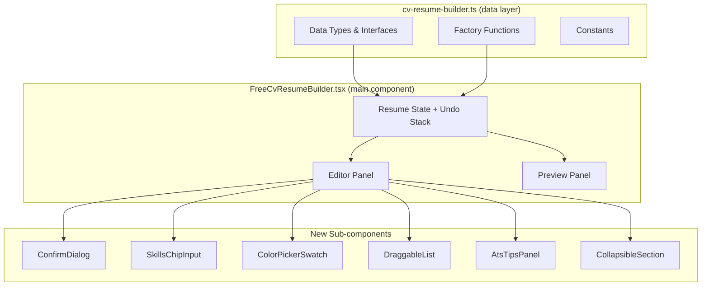
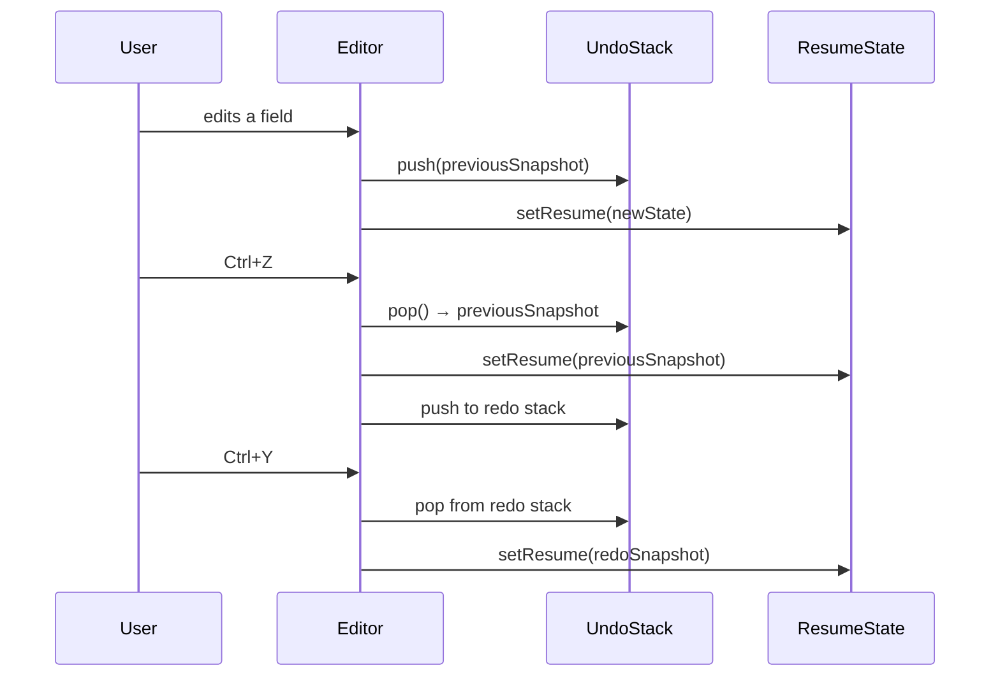
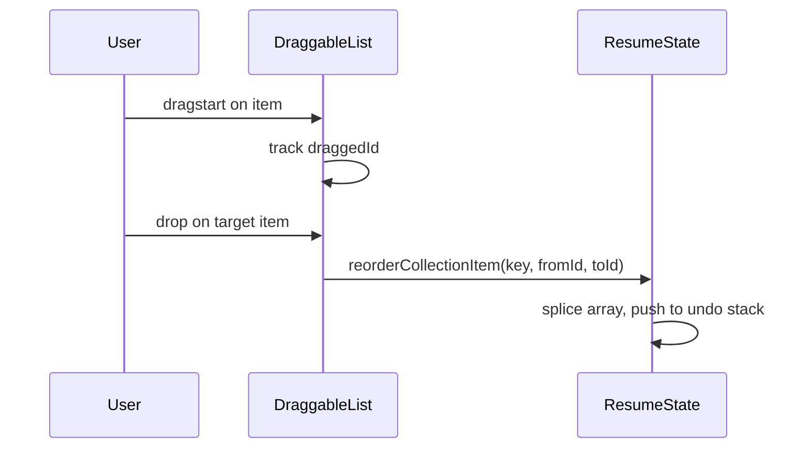
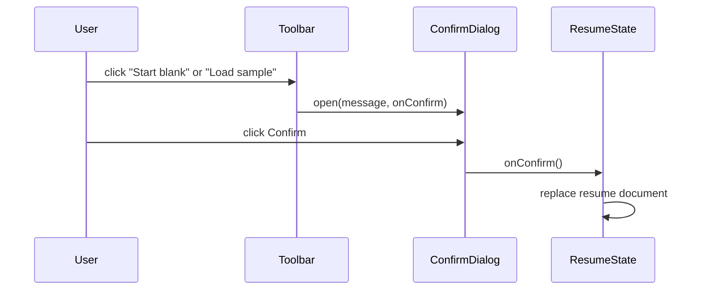

# Design Document: CV Resume Builder Improvements

## Overview

This document covers 15 improvements to the existing free CV/resume builder tool, spanning quick wins (confirmation dialogs, CSS page-break fixes, new fields), core UX upgrades (skills chip UI, independent preview scrolling, summary character count, font family options), and advanced features (drag-and-drop reordering, section reordering, undo/redo, project dates, ATS tips panel).

The existing architecture is a single large client component (`FreeCvResumeBuilder.tsx`) backed by a data-types/factory module (`cv-resume-builder.ts`). All improvements extend these two files plus introduce a small set of focused sub-components. No new routes or API endpoints are required.

---

## Architecture



---

## Sequence Diagrams

### Undo/Redo Flow



### Drag-and-Drop Reorder Flow



### Confirmation Dialog Flow



---

## Components and Interfaces

### ConfirmDialog

**Purpose**: Modal confirmation for destructive actions (Start blank, Load sample).

**Interface**:
```typescript
interface ConfirmDialogProps {
  open: boolean
  title: string
  description: string
  confirmLabel?: string   // default "Continue"
  cancelLabel?: string    // default "Cancel"
  onConfirm: () => void
  onCancel: () => void
}
```

**Responsibilities**:
- Render a modal overlay with title, description, and two action buttons
- Trap focus within the dialog while open
- Call `onConfirm` or `onCancel` and close

---

### SkillsChipInput

**Purpose**: Replace the plain textarea for skills with a chip/tag input.

**Interface**:
```typescript
interface SkillsChipInputProps {
  skills: string[]
  onChange: (skills: string[]) => void
  placeholder?: string
}
```

**Responsibilities**:
- Render existing skills as removable chips
- Accept keyboard input; commit chip on Enter or comma
- Remove chip on × click or Backspace when input is empty
- Deduplicate skills on add

---

### ColorPickerSwatch

**Purpose**: Extend the accent color section with a native `<input type="color">` alongside preset swatches.

**Interface**:
```typescript
interface ColorPickerSwatchProps {
  value: string
  presets: string[]
  onChange: (color: string) => void
}
```

**Responsibilities**:
- Render preset swatch buttons
- Render a native color picker input
- Highlight the active color (preset or custom)
- Debounce color picker `onChange` by ~100 ms to avoid excessive re-renders

---

### DraggableList

**Purpose**: Generic drag-and-drop wrapper for ordered lists of resume entries.

**Interface**:
```typescript
interface DraggableListProps<T extends { id: string }> {
  items: T[]
  onReorder: (fromIndex: number, toIndex: number) => void
  renderItem: (item: T, index: number) => React.ReactNode
}
```

**Responsibilities**:
- Use HTML5 drag-and-drop API (no external library dependency)
- Show a visual drop indicator between items
- Call `onReorder` with from/to indices on drop
- Support keyboard reorder via Up/Down arrow keys on drag handles

---

### AtsTipsPanel

**Purpose**: Collapsible sidebar/panel with ATS writing tips.

**Interface**:
```typescript
interface AtsTipsPanelProps {
  defaultOpen?: boolean
}
```

**Responsibilities**:
- Render a collapsible panel with a list of ATS tips
- Persist open/closed state in `localStorage`
- Tips are static content (no API call)

---

### CollapsibleSection

**Purpose**: Wrap each editor section (Personal Details, Work Experience, etc.) so it can be collapsed to reduce scroll length.

**Interface**:
```typescript
interface CollapsibleSectionProps {
  title: string
  defaultOpen?: boolean
  children: React.ReactNode
  badge?: string | number   // e.g. entry count
}
```

**Responsibilities**:
- Toggle open/closed on header click
- Animate height transition
- Show entry count badge when collapsed

---

## Data Models

### Updated `ResumePersonalDetails`

```typescript
interface ResumePersonalDetails {
  fullName: string
  role: string
  email: string
  phone: string
  location: string
  website: string
  linkedIn: string
  github: string       // NEW
  twitter: string      // NEW
  photoDataUrl: string
}
```

### Updated `ResumeEducation`

```typescript
interface ResumeEducation {
  id: string
  institution: string
  qualification: string
  location: string
  startDate: string
  endDate: string
  isCurrent: boolean   // NEW — mirrors ResumeExperience
  notesText: string
}
```

### Updated `ResumeProject`

```typescript
interface ResumeProject {
  id: string
  name: string
  link: string
  startDate: string    // NEW
  endDate: string      // NEW
  summary: string
}
```

### Updated `ResumeBuilderSettings`

```typescript
interface ResumeBuilderSettings {
  template: ResumeTemplate
  accentColor: string
  fontFamily: FontFamily   // NEW
  fontScale: number
  showPhoto: boolean
  showSummary: boolean
  showSkills: boolean
  showLanguages: boolean
  showProjects: boolean
  showCertifications: boolean
  showCustomSections: boolean
  sectionOrder: SectionKey[]   // NEW — ordered list of section identifiers
}

type FontFamily = "inter" | "georgia" | "mono"

type SectionKey =
  | "summary"
  | "workExperience"
  | "education"
  | "skills"
  | "languages"
  | "projects"
  | "certifications"
  | "customSections"
```

### Undo/Redo State (component-local, not persisted)

```typescript
interface UndoRedoStack {
  past: ResumeDocument[]    // max 50 snapshots
  future: ResumeDocument[]
}
```

---

## Key Functions with Formal Specifications

### `updateResumeWithUndo(updater)`

```typescript
function updateResumeWithUndo(
  updater: (current: ResumeDocument) => ResumeDocument
): void
```

**Preconditions:**
- `updater` is a pure function returning a new `ResumeDocument`
- `undoStack.past.length <= MAX_UNDO_STEPS` (50)

**Postconditions:**
- Current resume snapshot is pushed onto `undoStack.past`
- `undoStack.future` is cleared
- `resume` is set to `updater(current)`
- `updatedAt` is refreshed

**Loop Invariants:** N/A

---

### `undo()`

```typescript
function undo(): void
```

**Preconditions:**
- `undoStack.past.length > 0`

**Postconditions:**
- Current resume is pushed onto `undoStack.future`
- Last item from `undoStack.past` becomes the new `resume`

---

### `redo()`

```typescript
function redo(): void
```

**Preconditions:**
- `undoStack.future.length > 0`

**Postconditions:**
- Current resume is pushed onto `undoStack.past`
- Last item from `undoStack.future` becomes the new `resume`

---

### `reorderCollectionItem(key, fromIndex, toIndex)`

```typescript
function reorderCollectionItem(
  key: CollectionKey,
  fromIndex: number,
  toIndex: number
): void
```

**Preconditions:**
- `fromIndex !== toIndex`
- Both indices are within `[0, items.length - 1]`

**Postconditions:**
- Item at `fromIndex` is moved to `toIndex`
- All other items maintain relative order
- Change is pushed to undo stack

---

### `reorderSection(fromIndex, toIndex)`

```typescript
function reorderSection(fromIndex: number, toIndex: number): void
```

**Preconditions:**
- `fromIndex !== toIndex`
- Both indices are within `[0, sectionOrder.length - 1]`

**Postconditions:**
- `settings.sectionOrder` reflects the new order
- Preview re-renders sections in the new order

---

### `addSkill(skill)` / `removeSkill(skill)`

```typescript
function addSkill(skill: string): void
function removeSkill(skill: string): void
```

**`addSkill` Preconditions:**
- `skill.trim().length > 0`
- `skill` is not already in `resume.skills` (case-insensitive)

**`addSkill` Postconditions:**
- `resume.skills` contains the trimmed skill
- Change is pushed to undo stack

**`removeSkill` Postconditions:**
- `resume.skills` no longer contains `skill`
- Change is pushed to undo stack

---

### `computeSummaryHint(summary)`

```typescript
function computeSummaryHint(summary: string): string
```

**Preconditions:**
- `summary` is a string (may be empty)

**Postconditions:**
- Returns a string like `"3 sentences / 180 chars — recruiters prefer 3–5 sentences"`
- Sentence count is derived by splitting on `.`, `!`, `?` followed by whitespace or end-of-string
- Character count is `summary.length`

---

## Algorithmic Pseudocode

### Undo/Redo Key Handler

```pascal
PROCEDURE handleKeyDown(event)
  INPUT: event (KeyboardEvent)
  
  IF (event.ctrlKey OR event.metaKey) AND event.key = 'z' THEN
    event.preventDefault()
    IF event.shiftKey THEN
      redo()
    ELSE
      undo()
    END IF
  END IF
  
  IF (event.ctrlKey OR event.metaKey) AND event.key = 'y' THEN
    event.preventDefault()
    redo()
  END IF
END PROCEDURE
```

### Skills Chip Input Key Handler

```pascal
PROCEDURE handleSkillInputKeyDown(event, inputValue)
  INPUT: event (KeyboardEvent), inputValue (string)
  
  IF event.key = 'Enter' OR event.key = ',' THEN
    event.preventDefault()
    trimmed ← inputValue.trim().replace(',', '')
    IF trimmed.length > 0 AND trimmed NOT IN resume.skills THEN
      addSkill(trimmed)
      clearInput()
    END IF
  END IF
  
  IF event.key = 'Backspace' AND inputValue = '' AND resume.skills.length > 0 THEN
    removeSkill(resume.skills[LAST])
  END IF
END PROCEDURE
```

### DraggableList Drop Handler

```pascal
PROCEDURE handleDrop(event, targetIndex)
  INPUT: event (DragEvent), targetIndex (integer)
  
  event.preventDefault()
  fromIndex ← dragState.fromIndex
  
  IF fromIndex = targetIndex THEN
    RETURN
  END IF
  
  reorderCollectionItem(dragState.collectionKey, fromIndex, targetIndex)
  dragState ← null
END PROCEDURE
```

### Section Order Rendering

```pascal
PROCEDURE renderPreviewSections(resume)
  INPUT: resume (ResumeDocument)
  
  sectionOrder ← resume.settings.sectionOrder
  
  FOR each sectionKey IN sectionOrder DO
    IF sectionKey = 'summary' AND settings.showSummary AND resume.summary ≠ '' THEN
      renderSummarySection(resume.summary)
    ELSE IF sectionKey = 'workExperience' THEN
      renderWorkExperienceSection(resume.workExperience)
    ELSE IF sectionKey = 'education' THEN
      renderEducationSection(resume.education)
    ... (similar for remaining sections)
    END IF
  END FOR
END PROCEDURE
```

---

## Error Handling

### Confirmation Dialog — Accidental Dismiss

**Condition**: User presses Escape or clicks outside the dialog.
**Response**: Treat as Cancel — no destructive action is taken.
**Recovery**: Dialog closes, resume state is unchanged.

### Undo Stack Overflow

**Condition**: `undoStack.past.length` reaches `MAX_UNDO_STEPS` (50).
**Response**: Drop the oldest snapshot from the front of the array before pushing the new one.
**Recovery**: Undo history is capped; no data loss to current resume.

### Drag-and-Drop — Invalid Drop Target

**Condition**: User drops an item outside a valid drop zone.
**Response**: `dragend` event fires; `dragState` is reset to null; no reorder occurs.
**Recovery**: List remains in its previous order.

### Color Picker — Invalid Hex

**Condition**: Native `<input type="color">` always returns a valid 6-digit hex; no invalid state possible.
**Response**: N/A.

### `sectionOrder` Missing from Persisted Data

**Condition**: User has an older saved resume in localStorage that lacks `settings.sectionOrder`.
**Response**: `parseImportedResumeDocument` merges defaults — if `sectionOrder` is absent, inject the default order.
**Recovery**: Resume loads normally with default section order.

---

## Testing Strategy

### Unit Testing Approach

- `computeSummaryHint`: test empty string, single sentence, multi-sentence, edge punctuation
- `addSkill` / `removeSkill`: test deduplication, trimming, empty string rejection
- `reorderCollectionItem`: test boundary indices, same-index no-op
- `reorderSection`: test boundary indices
- `undo` / `redo`: test stack push/pop, empty stack no-op, stack cap at 50
- `formatResumeRange` with `isCurrent` on education entries

### Property-Based Testing Approach

**Property Test Library**: fast-check

- For any sequence of N `updateResumeWithUndo` calls followed by N `undo` calls, the resume should equal the initial state
- For any `reorderCollectionItem(key, from, to)`, the resulting array is a permutation of the original (same elements, same length)
- `computeSummaryHint` always returns a non-empty string for any string input

### Integration Testing Approach

- Render `FreeCvResumeBuilder`, type a skill, press Enter → chip appears, textarea is gone
- Render `FreeCvResumeBuilder`, click "Start blank" → ConfirmDialog appears → confirm → resume resets
- Keyboard shortcut Ctrl+Z after editing a field → field reverts

---

## Performance Considerations

- **Undo stack snapshots**: `ResumeDocument` objects are plain JSON (~5–20 KB each). 50 snapshots ≈ 1 MB max — acceptable for browser memory.
- **Color picker debounce**: Native color picker fires `input` events rapidly while dragging. Debounce at 100 ms prevents excessive re-renders of the preview.
- **DraggableList**: Uses HTML5 drag-and-drop (no library). No virtual DOM overhead beyond normal React reconciliation.
- **Preview scroll independence**: Achieved via `overflow-y: auto` + fixed height on the preview container, not a separate scroll context library.
- **Section order rendering**: `sectionOrder` is a small array (≤ 8 items); iteration cost is negligible.

---

## Security Considerations

- **Photo upload**: Already restricted to `image/*` MIME type. No server upload — data URL stored in localStorage only.
- **JSON import**: `parseImportedResumeDocument` validates shape before accepting. Malformed JSON throws and is caught; no eval or dynamic execution.
- **Color picker**: Native `<input type="color">` output is always a safe hex string; no injection risk.
- **ATS tips**: Static string content, no user input rendered as HTML.

---

## Dependencies

- No new npm packages required for core features.
- HTML5 Drag-and-Drop API (built-in browser).
- Native `<input type="color">` (built-in browser).
- `useReducer` or `useState` with explicit undo stack (React built-in).
- Existing: Tailwind CSS, React, Next.js, TypeScript.
