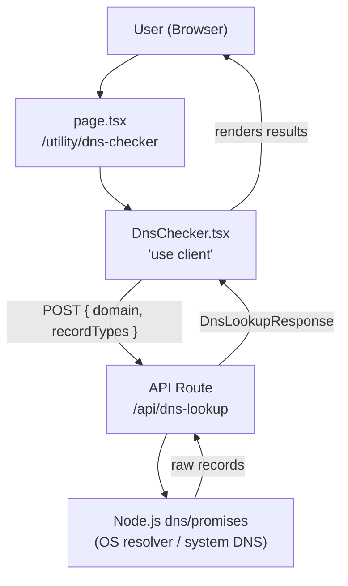
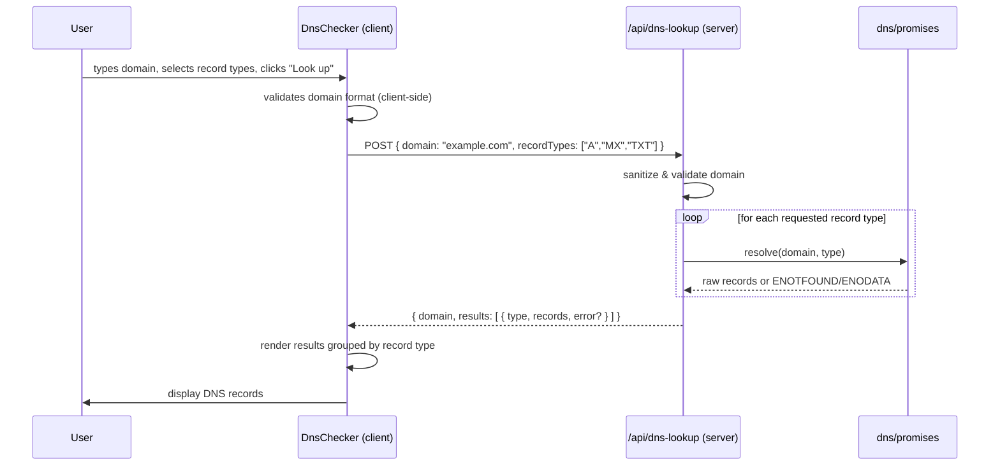
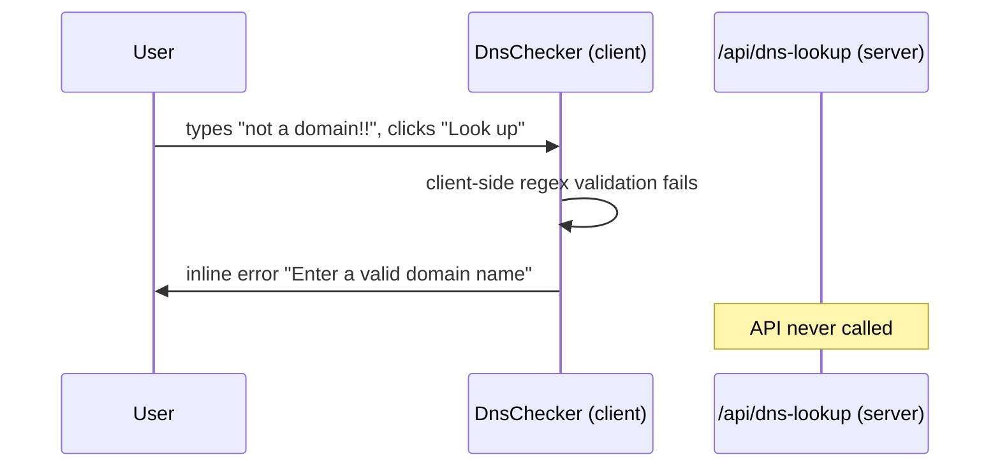
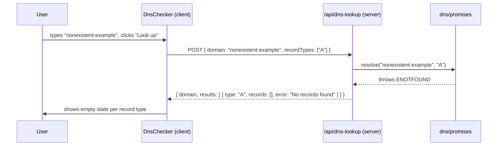

# Design Document: DNS Checker

## Overview

The DNS Checker is a utility tool that lets users look up DNS records for any domain directly from the browser. It fits into the existing Next.js platform under `/utility/dns-checker`, following the same page + component + API route pattern used by tools like the JWT Decoder and Website Palette extractor.

The tool queries a server-side API route that performs DNS lookups using Node.js's built-in `dns/promises` module, returning structured record data to a client-side React component that renders results in a clear, copy-friendly UI.

---

## Architecture



The architecture is intentionally simple:
- No external DNS-over-HTTPS service dependency — uses Node.js built-in resolver
- No caching layer needed at MVP (results are fast and stateless)
- Client component handles all UI state; server route handles all DNS I/O

---

## Sequence Diagrams

### Happy Path: Successful Lookup



### Error Path: Invalid Domain



### Error Path: Domain Not Found



---

## Components and Interfaces

### Component: `DnsChecker` (client)

**Purpose**: Manages all UI state — domain input, record type selection, loading state, and result rendering.

**Location**: `src/app/utility/dns-checker/components/DnsChecker.tsx`

**Interface**:
```typescript
// No props — self-contained tool component
export default function DnsChecker(): JSX.Element
```

**Responsibilities**:
- Controlled input for domain name
- Multi-select toggle for DNS record types (A, AAAA, MX, CNAME, TXT, NS, SOA, PTR, SRV, CAA)
- Client-side domain format validation before API call
- POST to `/api/dns-lookup` and handle loading/error states
- Render results grouped by record type with copy-to-clipboard per section

---

### API Route: `/api/dns-lookup`

**Purpose**: Server-side DNS resolution using Node.js `dns/promises`. Runs in the Node.js runtime (not Edge).

**Location**: `src/app/api/dns-lookup/route.ts`

**Interface**:
```typescript
// POST /api/dns-lookup
// Request body:
interface DnsLookupRequest {
  domain: string          // e.g. "example.com"
  recordTypes: DnsRecordType[]  // e.g. ["A", "MX"]
}

// Response body (200):
interface DnsLookupResponse {
  domain: string
  results: DnsRecordResult[]
}

// Response body (400):
interface DnsLookupErrorResponse {
  error: string
}
```

**Responsibilities**:
- Validate and sanitize the domain input
- Resolve each requested record type independently (parallel with `Promise.allSettled`)
- Normalize raw Node.js DNS results into `DnsRecordResult[]`
- Return structured JSON; never throw unhandled errors to the client

---

### Tool Logic: `src/lib/tools/dns.ts`

**Purpose**: Pure functions for domain validation and DNS result normalization. Keeps the API route thin and logic testable.

**Interface**:
```typescript
export function isValidDomain(input: string): boolean
export function normalizeDomain(input: string): string
export function normalizeRecords(type: DnsRecordType, raw: unknown): string[]
export const SUPPORTED_RECORD_TYPES: readonly DnsRecordType[]
```

---

## Data Models

### `DnsRecordType`

```typescript
type DnsRecordType =
  | "A"
  | "AAAA"
  | "MX"
  | "CNAME"
  | "TXT"
  | "NS"
  | "SOA"
  | "PTR"
  | "SRV"
  | "CAA"
```

### `DnsRecordResult`

```typescript
interface DnsRecordResult {
  type: DnsRecordType
  records: string[]   // normalized to human-readable strings
  error?: string      // "No records found" | "Lookup failed" — never raw Node error
}
```

### `DnsLookupResponse`

```typescript
interface DnsLookupResponse {
  domain: string           // the normalized domain that was queried
  results: DnsRecordResult[]
}
```

### UI State (internal to `DnsChecker`)

```typescript
interface DnsCheckerState {
  domain: string
  selectedTypes: Set<DnsRecordType>
  status: "idle" | "loading" | "success" | "error"
  response: DnsLookupResponse | null
  clientError: string | null   // validation errors before API call
  serverError: string | null   // errors from API response
}
```

**Validation Rules for domain input**:
- Must not be empty
- Must match `/^(?:[a-zA-Z0-9](?:[a-zA-Z0-9-]{0,61}[a-zA-Z0-9])?\.)+[a-zA-Z]{2,}$/`
- Strip leading `https://`, `http://`, `www.` before validation
- Max length: 253 characters (DNS spec)

---

## Algorithmic Pseudocode

### Domain Validation Algorithm

```pascal
FUNCTION isValidDomain(input)
  INPUT: input of type string
  OUTPUT: isValid of type boolean

  PRECONDITION: input is defined (may be empty string)
  POSTCONDITION: returns true iff input is a syntactically valid domain name

  BEGIN
    stripped ← stripProtocolAndWww(input.trim())

    IF stripped = "" OR stripped.length > 253 THEN
      RETURN false
    END IF

    RETURN DOMAIN_REGEX.test(stripped)
  END
```

**Loop Invariants**: N/A (no loops)

---

### DNS Lookup Algorithm (API Route)

```pascal
ALGORITHM handleDnsLookup(request)
  INPUT: HTTP POST request with JSON body { domain, recordTypes }
  OUTPUT: HTTP JSON response

  PRECONDITION: request body is parseable JSON
  POSTCONDITION:
    - Returns 400 if domain is invalid or recordTypes is empty/invalid
    - Returns 200 with DnsLookupResponse on success
    - Never returns 500 for DNS resolution failures (those become per-type errors)

  BEGIN
    body ← await request.json()

    IF body.domain is missing or not a string THEN
      RETURN 400 { error: "A domain name is required." }
    END IF

    normalized ← normalizeDomain(body.domain)

    IF NOT isValidDomain(normalized) THEN
      RETURN 400 { error: "Enter a valid domain name." }
    END IF

    types ← body.recordTypes filtered to SUPPORTED_RECORD_TYPES
    IF types is empty THEN
      types ← ["A", "AAAA", "MX", "CNAME", "TXT", "NS"]  // sensible defaults
    END IF

    // Resolve all types in parallel; never let one failure block others
    settlements ← await Promise.allSettled(
      types.map(type → resolveSingleType(normalized, type))
    )

    results ← []
    FOR i FROM 0 TO types.length - 1 DO
      settlement ← settlements[i]
      type ← types[i]

      IF settlement.status = "fulfilled" THEN
        results.append({ type, records: settlement.value, error: undefined })
      ELSE
        results.append({ type, records: [], error: classifyDnsError(settlement.reason) })
      END IF
    END FOR

    RETURN 200 { domain: normalized, results }
  END
```

**Loop Invariants**:
- All `results` entries appended so far correspond 1:1 with `types[0..i-1]`
- `results.length` equals `i` at the start of each iteration

---

### Single Record Type Resolution

```pascal
FUNCTION resolveSingleType(domain, type)
  INPUT: domain (string), type (DnsRecordType)
  OUTPUT: Promise<string[]>

  PRECONDITION: domain is a valid, normalized domain string
  POSTCONDITION:
    - Resolves with array of human-readable record strings (may be empty)
    - Rejects with a classified error if resolution fails

  BEGIN
    raw ← await dns.resolve(domain, type)   // Node.js dns/promises
    RETURN normalizeRecords(type, raw)
  END
```

---

### Record Normalization Algorithm

```pascal
FUNCTION normalizeRecords(type, raw)
  INPUT: type (DnsRecordType), raw (unknown — Node.js dns result)
  OUTPUT: string[]

  PRECONDITION: raw is the direct output of dns/promises.resolve(domain, type)
  POSTCONDITION: returns human-readable strings, one per record

  BEGIN
    MATCH type WITH
      CASE "A", "AAAA", "NS", "CNAME", "PTR":
        RETURN raw as string[]

      CASE "MX":
        // raw is { exchange: string, priority: number }[]
        RETURN raw.map(r → `${r.priority} ${r.exchange}`)
                  .sort by priority ascending

      CASE "TXT":
        // raw is string[][]
        RETURN raw.map(chunks → chunks.join(""))

      CASE "SOA":
        // raw is a single object
        RETURN [
          `nsname: ${raw.nsname}`,
          `hostmaster: ${raw.hostmaster}`,
          `serial: ${raw.serial}`,
          `refresh: ${raw.refresh}`,
          `retry: ${raw.retry}`,
          `expire: ${raw.expire}`,
          `minttl: ${raw.minttl}`
        ]

      CASE "SRV":
        // raw is { name, port, priority, weight }[]
        RETURN raw.map(r → `${r.priority} ${r.weight} ${r.port} ${r.name}`)

      CASE "CAA":
        // raw is { critical, issue, issuewild, iodef }[]
        RETURN raw.map(r → `${r.critical} ${r.issue ?? r.issuewild ?? r.iodef}`)

      DEFAULT:
        RETURN raw.map(r → String(r))
    END MATCH
  END
```

---

### DNS Error Classification

```pascal
FUNCTION classifyDnsError(error)
  INPUT: error (unknown — thrown by dns/promises)
  OUTPUT: string (user-friendly message)

  BEGIN
    IF error.code = "ENOTFOUND" OR error.code = "ENODATA" OR error.code = "ESERVFAIL" THEN
      RETURN "No records found"
    ELSE IF error.code = "ETIMEOUT" THEN
      RETURN "Lookup timed out"
    ELSE
      RETURN "Lookup failed"
    END IF
  END
```

---

## Key Functions with Formal Specifications

### `isValidDomain(input: string): boolean`

**Preconditions**:
- `input` is a defined string (may be empty)

**Postconditions**:
- Returns `true` iff `input` (after stripping protocol/www) matches the DNS label regex and is ≤ 253 chars
- Returns `false` for empty strings, IP addresses, strings with spaces, or strings exceeding 253 chars
- No side effects

---

### `normalizeDomain(input: string): string`

**Preconditions**:
- `input` is a non-empty string

**Postconditions**:
- Returns lowercase domain with leading `http://`, `https://`, `www.` stripped
- Trailing slash removed
- Result is suitable for passing to `dns/promises.resolve()`

---

### `normalizeRecords(type: DnsRecordType, raw: unknown): string[]`

**Preconditions**:
- `type` is a member of `SUPPORTED_RECORD_TYPES`
- `raw` is the direct unmodified output of `dns.resolve(domain, type)`

**Postconditions**:
- Returns a `string[]` where each element is a human-readable representation of one DNS record
- MX records are sorted by priority ascending
- SOA returns exactly 7 labeled strings
- Never throws; returns `[]` if `raw` is null/undefined

---

### `POST /api/dns-lookup` handler

**Preconditions**:
- Request method is POST
- Request body is valid JSON

**Postconditions**:
- Returns `400` with `{ error: string }` if domain is missing, invalid, or no valid record types provided
- Returns `200` with `DnsLookupResponse` otherwise
- Each `DnsRecordResult` in the response has either non-empty `records` or a non-empty `error` string
- Never returns `500` for DNS resolution failures (those are captured per-type)

**Loop Invariants** (over `Promise.allSettled` results):
- `results[i].type === types[i]` for all `i`
- `results.length === types.length` after the loop

---

## Example Usage

### API Request/Response

```typescript
// Request
POST /api/dns-lookup
Content-Type: application/json

{
  "domain": "github.com",
  "recordTypes": ["A", "MX", "TXT", "NS"]
}

// Response 200
{
  "domain": "github.com",
  "results": [
    {
      "type": "A",
      "records": ["140.82.121.4"]
    },
    {
      "type": "MX",
      "records": ["1 aspmx.l.google.com", "5 alt1.aspmx.l.google.com"]
    },
    {
      "type": "TXT",
      "records": ["v=spf1 ip4:192.30.252.0/22 include:_netblocks.google.com ~all"]
    },
    {
      "type": "NS",
      "records": ["dns1.p08.nsone.net", "dns2.p08.nsone.net"]
    }
  ]
}

// Response 400 (invalid domain)
{
  "error": "Enter a valid domain name."
}
```

### Client Component Usage

```typescript
// DnsChecker.tsx (simplified)
const [domain, setDomain] = useState("")
const [selectedTypes, setSelectedTypes] = useState<Set<DnsRecordType>>(
  new Set(["A", "AAAA", "MX", "CNAME", "TXT", "NS"])
)
const [status, setStatus] = useState<"idle" | "loading" | "success" | "error">("idle")
const [response, setResponse] = useState<DnsLookupResponse | null>(null)

async function handleLookup() {
  const normalized = normalizeDomain(domain)
  if (!isValidDomain(normalized)) {
    setClientError("Enter a valid domain name.")
    return
  }
  setStatus("loading")
  const res = await fetch("/api/dns-lookup", {
    method: "POST",
    headers: { "Content-Type": "application/json" },
    body: JSON.stringify({ domain: normalized, recordTypes: [...selectedTypes] }),
  })
  const data = await res.json()
  if (!res.ok) {
    setStatus("error")
    setServerError(data.error)
  } else {
    setStatus("success")
    setResponse(data)
  }
}
```

### Tool Logic Usage

```typescript
import { isValidDomain, normalizeDomain, normalizeRecords } from "@/lib/tools/dns"

// Normalize user input
normalizeDomain("https://www.GitHub.com/")  // → "github.com"
normalizeDomain("EXAMPLE.COM")              // → "example.com"

// Validate
isValidDomain("github.com")    // → true
isValidDomain("not a domain")  // → false
isValidDomain("192.168.1.1")   // → false (IP address)

// Normalize raw MX records from dns/promises
normalizeRecords("MX", [
  { exchange: "alt1.aspmx.l.google.com", priority: 5 },
  { exchange: "aspmx.l.google.com", priority: 1 },
])
// → ["1 aspmx.l.google.com", "5 alt1.aspmx.l.google.com"]
```

---

## Error Handling

### Error Scenario 1: Invalid Domain Input

**Condition**: User submits a string that fails domain regex validation (e.g., contains spaces, is an IP, is empty)
**Response**: Client-side validation catches this before any API call; inline error message shown below the input
**Recovery**: User corrects the domain and resubmits

### Error Scenario 2: Domain Does Not Exist (ENOTFOUND)

**Condition**: DNS resolver returns `ENOTFOUND` for the queried domain
**Response**: Per-type result shows `error: "No records found"` with an empty state indicator in the UI
**Recovery**: User tries a different domain

### Error Scenario 3: Record Type Has No Records (ENODATA)

**Condition**: Domain exists but has no records of the requested type (e.g., no AAAA records)
**Response**: That record type's result shows `error: "No records found"` — other types still display normally
**Recovery**: No action needed; expected behavior

### Error Scenario 4: DNS Timeout (ETIMEOUT)

**Condition**: DNS resolver times out for one or more record types
**Response**: Affected types show `error: "Lookup timed out"`; successful types still render
**Recovery**: User can retry the lookup

### Error Scenario 5: Malformed API Request

**Condition**: Request body is missing `domain` field or contains non-string value
**Response**: API returns `400 { error: "A domain name is required." }`
**Recovery**: Client always sends well-formed requests; this guards against direct API abuse

---

## Testing Strategy

### Unit Testing Approach

Test pure functions in `src/lib/tools/dns.ts` in isolation:
- `isValidDomain`: valid domains, invalid domains, edge cases (single-label, IP addresses, IDN, max length)
- `normalizeDomain`: protocol stripping, www stripping, case normalization, trailing slash
- `normalizeRecords`: each record type with realistic Node.js dns output shapes
- `classifyDnsError`: each DNS error code maps to the correct user message

### Property-Based Testing Approach

**Property Test Library**: fast-check (already available in the ecosystem; add as devDependency)

Key properties to verify:
- `normalizeDomain(normalizeDomain(x)) === normalizeDomain(x)` (idempotent)
- `isValidDomain(normalizeDomain(x))` is `true` for any string that `isValidDomain` accepts before normalization
- `normalizeRecords(type, raw).length === raw.length` for array-type records (A, AAAA, NS, MX, TXT, SRV, CAA)
- `normalizeRecords("SOA", raw).length === 7` for any valid SOA object

### Integration Testing Approach

Test the API route handler with mocked `dns/promises`:
- Mock `dns.resolve` to return realistic data per type
- Verify `Promise.allSettled` parallelism: one failing type does not prevent others from resolving
- Verify 400 responses for invalid inputs
- Verify response shape matches `DnsLookupResponse` interface

---

## Performance Considerations

- DNS lookups are performed in parallel via `Promise.allSettled` — querying 6 record types takes roughly as long as the slowest single lookup, not 6× longer
- No server-side caching at MVP; DNS TTLs are short and results are cheap to re-fetch
- The API route uses `runtime = "nodejs"` (not Edge) since `dns/promises` is a Node.js built-in
- Client renders results progressively as a single response (no streaming needed at this scale)

---

## Security Considerations

- Domain input is validated server-side against a strict regex before being passed to `dns/promises` — prevents injection of arbitrary hostnames
- `dns/promises` uses the system resolver; it does not make outbound HTTP requests, limiting SSRF surface
- Record type is validated against an allowlist (`SUPPORTED_RECORD_TYPES`) before use — prevents passing arbitrary strings to the DNS resolver
- No user data is stored; lookups are stateless
- The existing `X-Frame-Options: DENY` and `X-Content-Type-Options: nosniff` headers from `next.config.ts` apply automatically

---

## Dependencies

- `dns/promises` — Node.js built-in, no install required
- `next` / `react` — already in project
- `lucide-react` — already in project, used for UI icons
- `fast-check` — add as devDependency for property-based tests
- No external DNS-over-HTTPS API required


---

## Correctness Properties

*A property is a characteristic or behavior that should hold true across all valid executions of a system — essentially, a formal statement about what the system should do. Properties serve as the bridge between human-readable specifications and machine-verifiable correctness guarantees.*

### Property 1: Valid domains are accepted by the Validator

*For any* string that is a syntactically valid domain name (matches the DNS label regex and is ≤ 253 characters), `isValidDomain` SHALL return `true`.

**Validates: Requirements 1.1**

---

### Property 2: Invalid inputs are rejected by the Validator

*For any* string that is empty, contains whitespace, is an IPv4/IPv6 address, or exceeds 253 characters, `isValidDomain` SHALL return `false`.

**Validates: Requirements 1.2**

---

### Property 3: normalizeDomain is idempotent

*For any* input string `x`, `normalizeDomain(normalizeDomain(x))` SHALL equal `normalizeDomain(x)`.

**Validates: Requirements 5.7**

---

### Property 4: normalizeDomain produces lowercase output

*For any* input string, the output of `normalizeDomain` SHALL contain no uppercase characters.

**Validates: Requirements 1.4**

---

### Property 5: Normalization preserves validity

*For any* string `x` where `isValidDomain(x)` returns `true`, `isValidDomain(normalizeDomain(x))` SHALL also return `true`.

**Validates: Requirements 1.3, 1.4**

---

### Property 6: Array-type record normalization preserves count

*For any* valid raw DNS response array for record types A, AAAA, NS, CNAME, PTR, MX, TXT, SRV, or CAA, `normalizeRecords(type, raw).length` SHALL equal `raw.length`.

**Validates: Requirements 5.1, 5.2, 5.5, 5.6**

---

### Property 7: SOA normalization always returns exactly 7 fields

*For any* valid SOA record object returned by `dns/promises`, `normalizeRecords("SOA", raw)` SHALL return an array of exactly 7 strings.

**Validates: Requirements 5.4**

---

### Property 8: MX records are sorted by priority ascending

*For any* array of MX record objects, `normalizeRecords("MX", raw)` SHALL return strings where the numeric priority prefix of each element is less than or equal to the priority prefix of the next element.

**Validates: Requirements 5.2**

---

### Property 9: All requested record types appear in the API response

*For any* valid domain and any non-empty subset of SUPPORTED_RECORD_TYPES, the `results` array in the `DnsLookupResponse` SHALL contain exactly one `DnsRecordResult` entry per requested type, regardless of whether individual lookups succeed or fail.

**Validates: Requirements 3.1, 3.6**

---

### Property 10: API never returns 500 for DNS resolution failures

*For any* DNS error condition (ENOTFOUND, ENODATA, ESERVFAIL, ETIMEOUT, or unknown), the API_Route SHALL return HTTP 200 with a per-type `error` field rather than an HTTP 500 response.

**Validates: Requirements 3.3, 3.4, 3.5, 3.7**

---

### Property 11: Invalid domains are rejected by the API with 400

*For any* string that fails domain validation, a POST to `/api/dns-lookup` with that string as `domain` SHALL return HTTP 400.

**Validates: Requirements 4.2**

---

### Property 12: Unsupported record types are filtered from API requests

*For any* `recordTypes` array containing values outside SUPPORTED_RECORD_TYPES, the API_Route SHALL process only the subset of values that are members of SUPPORTED_RECORD_TYPES.

**Validates: Requirements 2.4, 4.4**
