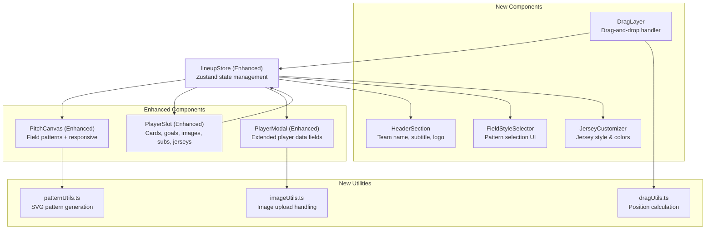
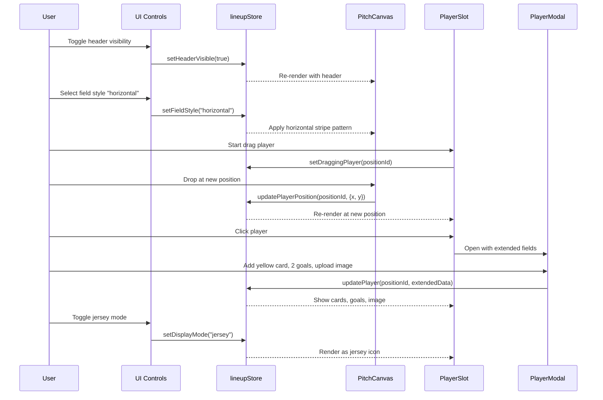

n# Design Document: Football Lineup Builder Enhancements

## Overview

This document specifies enhancements to the existing Football Lineup Builder at `/sport/football-lineup-builder`. The enhancements add seven major feature areas: mobile layout optimization, drag-and-drop player positioning, toggle-able header options, field style customization, player card enhancements (cards/goals/images), jersey representation mode, and substitution display. All features maintain the existing client-side architecture using Zustand for state management, Tailwind for styling, and html-to-image for export.

---

## Architecture



---

## Main Algorithm/Workflow



---

## Components and Interfaces

### Component: HeaderSection

**Purpose**: Renders optional header with team name, subtitle, and logo above the pitch.

**Location**: `src/app/sport/football-lineup-builder/components/HeaderSection.tsx`

**Interface**:
```typescript
interface HeaderSectionProps {
  teamName: string
  subtitle: string
  logoUrl: string | null
  visible: boolean
}
export default function HeaderSection(props: HeaderSectionProps): JSX.Element | null
```

**Responsibilities**:
- Renders team name, subtitle, and logo when visible is true
- Returns null when visible is false
- Handles logo image loading and error states
- Responsive sizing for mobile vs desktop

---

### Component: FieldStyleSelector

**Purpose**: UI control for selecting field pattern style.

**Location**: `src/app/sport/football-lineup-builder/components/FieldStyleSelector.tsx`

**Interface**:
```typescript
type FieldStyle = "none" | "horizontal" | "vertical" | "checkered" | "diagonal" | "rings"

interface FieldStyleSelectorProps {
  currentStyle: FieldStyle
  onChange: (style: FieldStyle) => void
}
export default function FieldStyleSelector(props: FieldStyleSelectorProps): JSX.Element
```

**Responsibilities**:
- Displays visual previews of each field style
- Calls onChange when user selects a style
- Highlights currently selected style

---

### Component: JerseyCustomizer

**Purpose**: UI control for jersey display mode and customization.

**Location**: `src/app/sport/football-lineup-builder/components/JerseyCustomizer.tsx`

**Interface**:
```typescript
type JerseyStyle = "plain" | "vertical-stripes" | "horizontal-stripes"
type DisplayMode = "circle" | "jersey"

interface JerseyCustomizerProps {
  displayMode: DisplayMode
  jerseyStyle: JerseyStyle
  jerseyPrimaryColor: string
  jerseySecondaryColor: string
  jerseyTextColor: string
  onDisplayModeChange: (mode: DisplayMode) => void
  onJerseyStyleChange: (style: JerseyStyle) => void
  onJerseyPrimaryColorChange: (color: string) => void
  onJerseySecondaryColorChange: (color: string) => void
  onJerseyTextColorChange: (color: string) => void
}
export default function JerseyCustomizer(props: JerseyCustomizerProps): JSX.Element
```

**Responsibilities**:
- Toggle between circle and jersey display modes
- Select jersey style (plain, vertical stripes, horizontal stripes)
- Color pickers for jersey primary, secondary, and text colors
- Visual preview of jersey appearance

---

### Component: PlayerSlot (Enhanced)

**Purpose**: Renders a player position with extended features: drag-and-drop, cards, goals, images, jerseys, substitutes.

**Location**: `src/app/sport/football-lineup-builder/components/PlayerSlot.tsx` (enhanced)

**Interface**:
```typescript
interface ExtendedPlayerData {
  name: string
  jersey: string
  cardType: "none" | "yellow" | "red" | "double-yellow"
  goalCount: number
  imageUrl: string | null
  substituteName: string
}

interface PlayerSlotProps {
  positionId: string
  label: string
  x: number
  y: number
  player: ExtendedPlayerData | null
  primaryColor: string
  secondaryColor: string
  displayMode: DisplayMode
  jerseyStyle: JerseyStyle
  jerseyPrimaryColor: string
  jerseySecondaryColor: string
  jerseyTextColor: string
  draggable: boolean
  onClick: (positionId: string) => void
  onDragStart: (positionId: string) => void
  onDragEnd: () => void
}
export default function PlayerSlot(props: PlayerSlotProps): JSX.Element
```

**Responsibilities**:
- Render player as circle OR jersey based on displayMode
- Show player image if provided (replaces jersey number in circle mode)
- Display card icons (yellow, red, double-yellow) above player
- Display goal count as ball icons below player
- Show substitute name below main player name
- Handle drag start/end events
- Position using custom coordinates if overridden

---

### Component: PlayerModal (Enhanced)

**Purpose**: Extended modal for editing all player data including cards, goals, image, and substitute.

**Location**: `src/app/sport/football-lineup-builder/components/PlayerModal.tsx` (enhanced)

**Interface**:
```typescript
interface PlayerModalProps {
  positionId: string
  positionLabel: string
  player: ExtendedPlayerData | null
  onSave: (data: ExtendedPlayerData) => void
  onClear: (positionId: string) => void
  onClose: () => void
}
export default function PlayerModal(props: PlayerModalProps): JSX.Element
```

**Responsibilities**:
- All existing fields (name, jersey)
- Card type selector (none, yellow, red, double-yellow)
- Goal count input (0-10)
- Image upload button with preview
- Substitute name input (max 25 chars)
- Validation for all fields
- Save/Clear/Cancel actions

---

### Component: PitchCanvas (Enhanced)

**Purpose**: Renders pitch with field patterns, responsive sizing, and drag-drop zones.

**Location**: `src/app/sport/football-lineup-builder/components/PitchCanvas.tsx` (enhanced)

**Interface**:
```typescript
interface PitchCanvasProps {
  forwardedRef?: React.RefObject<HTMLDivElement>
  fieldStyle: FieldStyle
  onPlayerDrop: (positionId: string, x: number, y: number) => void
}
export default function PitchCanvas(props: PitchCanvasProps): JSX.Element
```

**Responsibilities**:
- Apply selected field pattern (SVG patterns for stripes, checkered, etc.)
- Responsive sizing: compact on mobile (<768px), full on desktop
- Handle drop events to update player positions
- Calculate drop coordinates relative to pitch dimensions
- Render HeaderSection if enabled
- Render all PlayerSlot components

---

## Data Models

### ExtendedPlayerData

```typescript
interface ExtendedPlayerData {
  name: string              // max 25 characters
  jersey: string            // "1"-"99" or empty
  cardType: "none" | "yellow" | "red" | "double-yellow"
  goalCount: number         // 0-10
  imageUrl: string | null   // data URL or null
  substituteName: string    // max 25 characters
}
```

**Validation Rules**:
- name.length <= 25
- jersey is empty or integer in [1, 99]
- cardType is one of the four valid values
- goalCount is integer in [0, 10]
- imageUrl is valid data URL or null
- substituteName.length <= 25

---

### HeaderConfig

```typescript
interface HeaderConfig {
  visible: boolean
  teamName: string          // max 30 characters
  subtitle: string          // max 50 characters
  logoUrl: string | null    // data URL or null
}
```

**Validation Rules**:
- teamName.length <= 30
- subtitle.length <= 50
- logoUrl is valid data URL or null

---

### FieldStyle

```typescript
type FieldStyle = "none" | "horizontal" | "vertical" | "checkered" | "diagonal" | "rings"
```

---

### JerseyConfig

```typescript
interface JerseyConfig {
  displayMode: "circle" | "jersey"
  style: "plain" | "vertical-stripes" | "horizontal-stripes"
  primaryColor: string      // hex color
  secondaryColor: string    // hex color
  textColor: string         // hex color
}
```

---

### PlayerPosition

```typescript
interface PlayerPosition {
  positionId: string
  x: number                 // 0-100 percentage
  y: number                 // 0-100 percentage
  isCustom: boolean         // true if user dragged, false if formation default
}
```

**Validation Rules**:
- x in [5, 95]
- y in [5, 95]

---

### Enhanced LineupState

```typescript
interface EnhancedLineupState extends LineupState {
  // Existing fields
  formation: FormationId
  players: Record<string, ExtendedPlayerData>
  teamName: string
  primaryColor: string
  secondaryColor: string
  activePositionId: string | null
  
  // New fields
  headerConfig: HeaderConfig
  fieldStyle: FieldStyle
  jerseyConfig: JerseyConfig
  customPositions: Record<string, PlayerPosition>
  draggingPlayerId: string | null
}
```

---

## Algorithmic Pseudocode

### Drag-and-Drop Position Update Algorithm

```typescript
function handlePlayerDrop(
  positionId: string,
  dropX: number,
  dropY: number,
  pitchWidth: number,
  pitchHeight: number
): void
```

**Preconditions**:
- positionId is valid slot in current formation
- dropX, dropY are screen coordinates within pitch bounds
- pitchWidth > 0, pitchHeight > 0

**Postconditions**:
- customPositions[positionId] contains new percentage coordinates
- isCustom flag is set to true
- draggingPlayerId is set to null

**Algorithm**:
```typescript
BEGIN
  // Convert screen coordinates to percentage
  percentX ← (dropX / pitchWidth) * 100
  percentY ← (dropY / pitchHeight) * 100
  
  // Clamp to valid bounds
  clampedX ← max(5, min(95, percentX))
  clampedY ← max(5, min(95, percentY))
  
  // Update store
  customPositions[positionId] ← {
    positionId: positionId,
    x: clampedX,
    y: clampedY,
    isCustom: true
  }
  
  draggingPlayerId ← null
END
```

---

### Field Pattern Generation Algorithm

```typescript
function generateFieldPattern(style: FieldStyle): string
```

**Preconditions**:
- style is one of: "none", "horizontal", "vertical", "checkered", "diagonal", "rings"

**Postconditions**:
- Returns SVG pattern definition string
- Pattern is tileable and seamless

**Algorithm**:
```typescript
BEGIN
  MATCH style WITH
    | "none" → RETURN ""
    
    | "horizontal" →
        RETURN SVG pattern with horizontal stripes
        stripe width: 100% of pattern
        stripe height: 10% of pattern
        alternating colors: #1a7a3c and #1e8f47
    
    | "vertical" →
        RETURN SVG pattern with vertical stripes
        stripe width: 10% of pattern
        stripe height: 100% of pattern
        alternating colors: #1a7a3c and #1e8f47
    
    | "checkered" →
        RETURN SVG pattern with checkered squares
        square size: 10% × 10%
        alternating colors in grid pattern
    
    | "diagonal" →
        RETURN SVG pattern with diagonal stripes
        45-degree angle stripes
        stripe width: 10% of pattern diagonal
    
    | "rings" →
        RETURN SVG pattern with concentric circles
        center at pitch center
        ring spacing: 15% of pitch width
        
  END MATCH
END
```

---

### Image Upload and Validation Algorithm

```typescript
function handleImageUpload(file: File): Promise<string | null>
```

**Preconditions**:
- file is a File object from input[type="file"]

**Postconditions**:
- Returns data URL string if valid image
- Returns null if invalid or error
- Image is resized to max 200×200px

**Algorithm**:
```typescript
BEGIN
  // Validate file type
  IF NOT file.type.startsWith("image/") THEN
    RETURN null
  END IF
  
  // Validate file size (max 2MB)
  IF file.size > 2 * 1024 * 1024 THEN
    RETURN null
  END IF
  
  // Read file as data URL
  dataUrl ← await readFileAsDataURL(file)
  
  // Create image element to get dimensions
  img ← new Image()
  img.src ← dataUrl
  await img.onload
  
  // Resize if needed
  IF img.width > 200 OR img.height > 200 THEN
    resizedDataUrl ← resizeImage(img, 200, 200)
    RETURN resizedDataUrl
  ELSE
    RETURN dataUrl
  END IF
END
```

---

### Jersey Rendering Algorithm

```typescript
function renderJersey(
  jerseyConfig: JerseyConfig,
  displayText: string
): JSX.Element
```

**Preconditions**:
- jerseyConfig contains valid style and colors
- displayText is player position label or jersey number

**Postconditions**:
- Returns JSX element representing jersey SVG
- Jersey matches selected style and colors

**Algorithm**:
```typescript
BEGIN
  MATCH jerseyConfig.style WITH
    | "plain" →
        body ← solid fill with primaryColor
        shoulders ← solid fill with secondaryColor
        
    | "vertical-stripes" →
        body ← vertical stripes alternating primaryColor and secondaryColor
        stripe count: 5 stripes
        
    | "horizontal-stripes" →
        body ← horizontal stripes alternating primaryColor and secondaryColor
        stripe count: 3 stripes
  END MATCH
  
  // Add text overlay
  text ← displayText
  textColor ← jerseyConfig.textColor
  textPosition ← center of jersey
  
  RETURN SVG element with body pattern and text
END
```

---

### Mobile Layout Optimization Algorithm

```typescript
function calculatePitchDimensions(viewportWidth: number): {
  width: number,
  height: number,
  scale: number
}
```

**Preconditions**:
- viewportWidth > 0

**Postconditions**:
- Returns dimensions optimized for viewport
- Maintains 2:3 aspect ratio
- Mobile uses compact sizing

**Algorithm**:
```typescript
BEGIN
  IF viewportWidth < 768 THEN
    // Mobile: compact layout
    width ← min(viewportWidth - 32, 300)
    height ← width * 1.5
    scale ← 0.8
  ELSE
    // Desktop: full layout
    width ← min(viewportWidth * 0.45, 400)
    height ← width * 1.5
    scale ← 1.0
  END IF
  
  RETURN { width, height, scale }
END
```

---

## Key Functions with Formal Specifications

### `updatePlayerPosition(positionId: string, x: number, y: number): void`

**Preconditions**:
- positionId is valid slot in current formation
- x ∈ [5, 95]
- y ∈ [5, 95]

**Postconditions**:
- customPositions[positionId].x === x
- customPositions[positionId].y === y
- customPositions[positionId].isCustom === true
- All other customPositions entries unchanged

---

### `setFieldStyle(style: FieldStyle): void`

**Preconditions**:
- style is one of: "none", "horizontal", "vertical", "checkered", "diagonal", "rings"

**Postconditions**:
- store.fieldStyle === style
- PitchCanvas re-renders with new pattern

---

### `updateExtendedPlayer(positionId: string, data: ExtendedPlayerData): void`

**Preconditions**:
- positionId is valid slot in current formation
- data.name.length <= 25
- data.jersey is "" or integer in [1, 99]
- data.cardType is valid enum value
- data.goalCount ∈ [0, 10]
- data.substituteName.length <= 25

**Postconditions**:
- store.players[positionId] === sanitized(data)
- store.activePositionId === null
- All other players entries unchanged

---

### `setHeaderConfig(config: Partial<HeaderConfig>): void`

**Preconditions**:
- config.teamName.length <= 30 (if provided)
- config.subtitle.length <= 50 (if provided)
- config.logoUrl is valid data URL or null (if provided)

**Postconditions**:
- store.headerConfig is updated with provided fields
- Other headerConfig fields unchanged

---

### `resetCustomPositions(): void`

**Preconditions**: None

**Postconditions**:
- store.customPositions === {}
- All players return to formation default positions

---

### `uploadPlayerImage(positionId: string, file: File): Promise<void>`

**Preconditions**:
- positionId is valid slot in current formation
- file is image file <= 2MB

**Postconditions**:
- If successful: store.players[positionId].imageUrl contains resized data URL
- If failed: imageUrl remains unchanged, error is surfaced to UI

---

## Example Usage

### Store Usage - Extended Player Data

```typescript
import { useLineupStore } from "@/app/sport/football-lineup-builder/store/lineupStore"

// Update player with extended data
const updatePlayer = useLineupStore(s => s.updateExtendedPlayer)
updatePlayer("st-1", {
  name: "Messi",
  jersey: "10",
  cardType: "yellow",
  goalCount: 2,
  imageUrl: "data:image/png;base64,...",
  substituteName: "Aguero"
})

// Enable header
const setHeaderConfig = useLineupStore(s => s.setHeaderConfig)
setHeaderConfig({
  visible: true,
  teamName: "FC Barcelona",
  subtitle: "Champions League Final 2023",
  logoUrl: "data:image/png;base64,..."
})

// Change field style
const setFieldStyle = useLineupStore(s => s.setFieldStyle)
setFieldStyle("horizontal")

// Enable jersey mode
const setJerseyConfig = useLineupStore(s => s.setJerseyConfig)
setJerseyConfig({
  displayMode: "jersey",
  style: "vertical-stripes",
  primaryColor: "#0000ff",
  secondaryColor: "#ff0000",
  textColor: "#ffffff"
})
```

### Drag-and-Drop Usage

```typescript
// In PlayerSlot component
const handleDragStart = (e: React.DragEvent) => {
  e.dataTransfer.effectAllowed = "move"
  e.dataTransfer.setData("positionId", positionId)
  onDragStart(positionId)
}

// In PitchCanvas component
const handleDrop = (e: React.DragEvent) => {
  e.preventDefault()
  const positionId = e.dataTransfer.getData("positionId")
  const rect = pitchRef.current!.getBoundingClientRect()
  const dropX = e.clientX - rect.left
  const dropY = e.clientY - rect.top
  
  onPlayerDrop(positionId, dropX, dropY)
}
```

### Image Upload Usage

```typescript
// In PlayerModal component
const handleImageUpload = async (e: React.ChangeEvent<HTMLInputElement>) => {
  const file = e.target.files?.[0]
  if (!file) return
  
  try {
    const dataUrl = await uploadPlayerImage(positionId, file)
    setImagePreview(dataUrl)
  } catch (err) {
    setError("Failed to upload image")
  }
}
```

### Field Pattern Usage

```typescript
// In PitchCanvas component
const patternDef = generateFieldPattern(fieldStyle)

return (
  <svg className="absolute inset-0">
    <defs>
      {patternDef && (
        <pattern id="field-pattern" patternUnits="userSpaceOnUse" width="100" height="100">
          {patternDef}
        </pattern>
      )}
    </defs>
    <rect width="100%" height="100%" fill={patternDef ? "url(#field-pattern)" : "#1a7a3c"} />
  </svg>
)
```

---

## Correctness Properties

*A property is a characteristic or behavior that should hold true across all valid executions of a system — essentially, a formal statement about what the system should do. Properties serve as the bridge between human-readable specifications and machine-verifiable correctness guarantees.*

### Property 1: Pitch maintains 2:3 aspect ratio across all viewports

*For any* viewport width, the pitch dimensions SHALL maintain a 2:3 aspect ratio (width:height).

**Validates: Requirement 1.4**

---

### Property 2: Mobile viewport triggers compact layout

*For any* viewport width less than 768px, the pitch height SHALL be approximately 60% of screen height AND player slots SHALL be scaled by 0.8x.

**Validates: Requirements 1.1, 1.5**

---

### Property 3: Desktop viewport triggers full layout

*For any* viewport width greater than or equal to 768px, the pitch SHALL render at full desktop dimensions.

**Validates: Requirement 1.3**

---

### Property 4: Formation changes preserve existing player data

*For any* formation change, player data for positions that exist in both the old and new formations SHALL be preserved.

**Validates: Requirements 2.3, 3.4**

---

### Property 5: Undo-redo is identity operation

*For any* state change, performing undo followed by redo SHALL result in the same state as before the undo.

**Validates: Requirements 4.1, 4.2**

---

### Property 6: Custom positions are always clamped to valid bounds

*For any* custom position update, the x and y coordinates SHALL be clamped to the range [5, 95] percent.

**Validates: Requirements 5.3, 5.4**

---

### Property 7: Drag-drop updates position with percentage coordinates

*For any* player drag-and-drop operation on the pitch, the system SHALL convert screen coordinates to percentage values and update the player's custom position.

**Validates: Requirements 5.1, 5.2**

---

### Property 8: Out-of-bounds drops revert to previous position

*For any* player drop outside pitch bounds, the player SHALL revert to their previous position.

**Validates: Requirement 5.5**

---

### Property 9: Custom positions are flagged as custom

*For any* player position set via drag-and-drop, the position SHALL be stored with isCustom flag set to true.

**Validates: Requirement 5.6**

---

### Property 10: Reset positions clears all custom overrides

*For any* lineup state, calling reset positions SHALL clear all custom positions and return all players to formation default positions.

**Validates: Requirement 5.7**

---

### Property 11: String inputs respect maximum length constraints

*For any* text input (team name ≤ 30 chars, subtitle ≤ 50 chars, player name ≤ 25 chars, substitute name ≤ 25 chars), the system SHALL enforce the maximum length constraint.

**Validates: Requirements 6.4, 6.5, 13.2, 14.1, 14.5**

---

### Property 12: Image uploads are validated and resized

*For any* image upload (logo or player image), the system SHALL reject files larger than 2MB or non-image files, and SHALL resize valid images to a maximum of 200×200 pixels.

**Validates: Requirements 6.6, 6.7, 10.2, 10.3, 10.4, 10.5**

---

### Property 13: Field style selection applies corresponding pattern

*For any* field style selection, the system SHALL apply the corresponding SVG pattern to the pitch background.

**Validates: Requirement 7.2**

---

### Property 14: Card type determines icon display

*For any* player, the displayed card icons SHALL match the player's card type: no icons for "none", yellow icon for "yellow", red icon for "red", two yellow icons for "double-yellow".

**Validates: Requirements 8.2, 8.3, 8.4, 8.5**

---

### Property 15: Goal count is clamped and displayed correctly

*For any* goal count input, the system SHALL clamp the value to the range [0, 10] and display exactly that many ball icons below the player slot.

**Validates: Requirements 9.2, 9.3, 9.4**

---

### Property 16: Player images replace jersey numbers in circle mode

*For any* player with an uploaded image in circle display mode, the system SHALL display the image instead of the jersey number.

**Validates: Requirement 10.6**

---

### Property 17: Player images are stored as data URLs

*For any* uploaded player image, the system SHALL store it as a data URL.

**Validates: Requirement 10.7**

---

### Property 18: Display mode determines rendering style

*For any* lineup, when jersey mode is enabled all player slots SHALL render as jersey icons, and when circle mode is enabled all player slots SHALL render as circles.

**Validates: Requirements 11.2, 11.3**

---

### Property 19: Jersey mode displays position label or custom number

*For any* player in jersey mode, the jersey SHALL display either the position label or the custom jersey number.

**Validates: Requirement 11.4**

---

### Property 20: Jersey style determines pattern rendering

*For any* jersey configuration, the jersey SHALL render with the pattern corresponding to the selected style: plain with colored shoulders, 5 vertical stripes, or 3 horizontal stripes.

**Validates: Requirements 12.5, 12.6, 12.7**

---

### Property 21: Color inputs are validated as hex codes

*For any* color input (jersey primary, secondary, text), the system SHALL validate that the input is a valid hex color code.

**Validates: Requirement 12.8**

---

### Property 22: Substitute names are displayed conditionally

*For any* player, the substitute name SHALL be displayed below the main player name if and only if a substitute name is provided.

**Validates: Requirements 13.3, 13.4**

---

### Property 23: Extended player data is always valid

*For any* player in the store, all fields SHALL meet validation rules: name length ≤ 25, jersey empty or in [1, 99], card type is valid enum, goal count in [0, 10], substitute name length ≤ 25.

**Validates: Requirements 14.1, 14.2, 14.3, 14.4, 14.5**

---

### Property 24: Invalid data is sanitized before storage

*For any* invalid player data input, the system SHALL sanitize it to meet validation rules before storing.

**Validates: Requirement 14.6**

---

### Property 25: Export includes all enabled features

*For any* lineup export, the exported image SHALL include all enabled features: header (if visible), field pattern, player images, jersey rendering (if enabled), cards, and goals.

**Validates: Requirements 15.2, 15.3, 15.4, 15.5**

---

### Property 26: State updates persist to store

*For any* state update (player data, header config, field style, jersey config, custom positions), the system SHALL persist the change to the Zustand store.

**Validates: Requirements 16.1, 16.2, 16.3, 16.4, 16.5**

---

### Property 27: Drag state transitions are consistent

*For any* drag operation, draggingPlayerId SHALL be set to the player's position ID on drag start, and SHALL be set to null on drag completion or cancellation.

**Validates: Requirements 17.1, 17.2, 17.4**

---

### Property 28: Exactly one player has drag feedback when dragging

*When* draggingPlayerId is not null, exactly one player slot SHALL display visual drag feedback.

**Validates: Requirement 17.3**

---

### Property 29: Store updates are deferred during drag

*For any* drag operation, the store SHALL not be updated until the drop is completed.

**Validates: Requirement 18.2**

---

### Property 30: Export waits for image loading

*For any* lineup export containing images, the system SHALL ensure all images are loaded before calling html-to-image.

**Validates: Requirement 18.5**

---

## Error Handling

### Error Scenario 1: Invalid image upload

**Condition**: User uploads non-image file or file > 2MB
**Response**: Show inline error "Invalid image file. Please upload an image under 2MB."
**Recovery**: User selects different file

### Error Scenario 2: Drag outside pitch bounds

**Condition**: User drops player outside pitch area
**Response**: Player snaps back to previous position
**Recovery**: User drags again within bounds

### Error Scenario 3: Logo image fails to load

**Condition**: Logo URL is invalid or image fails to load
**Response**: Show placeholder icon in header
**Recovery**: User re-uploads logo

### Error Scenario 4: Invalid goal count

**Condition**: User enters goal count < 0 or > 10
**Response**: Clamp to [0, 10] range, show validation message
**Recovery**: Value is auto-corrected

### Error Scenario 5: Export with header images

**Condition**: Header logo or player images fail to render in export
**Response**: Export proceeds with placeholders, show warning
**Recovery**: User can retry or remove problematic images

---

## Testing Strategy

### Unit Testing Approach

Test pure functions:
- `generateFieldPattern`: all six styles produce valid SVG
- `calculatePitchDimensions`: mobile vs desktop sizing
- `handleImageUpload`: file validation, size limits, resizing
- `clampPosition`: boundary enforcement
- Extended validation functions for new fields

### Property-Based Testing Approach

**Property Test Library**: fast-check

Key properties:
- Custom positions always within [5, 95] bounds after any drag operation
- Extended player data always valid after any update
- Image data URLs always represent images <= 200×200px
- Field patterns are always valid SVG for any style
- Mobile dimensions always maintain 2:3 aspect ratio

### Integration Testing Approach

Test complete workflows:
- Drag player → verify custom position stored → reset → verify back to default
- Upload player image → verify displayed → export → verify in PNG
- Toggle jersey mode → verify all players render as jerseys
- Enable header → add logo → export → verify header in PNG
- Change field style → verify pattern applied → export → verify in PNG

---

## Performance Considerations

- **Drag-and-drop**: Use CSS transforms for smooth dragging, update store only on drop
- **Image uploads**: Resize images client-side to 200×200px max to reduce memory
- **Field patterns**: Use SVG patterns (GPU-accelerated) instead of repeated elements
- **Mobile optimization**: Reduce pitch size by 20% on mobile to fit screen
- **Jersey rendering**: Cache jersey SVG components to avoid re-rendering
- **Export**: Ensure all images are loaded before calling html-to-image

---

## Security Considerations

- **Image uploads**: Validate file type and size client-side, use data URLs (no server upload)
- **XSS prevention**: All user input (names, subtitles) rendered via React JSX (auto-escaped)
- **Data URLs**: Limit total data URL size to prevent memory exhaustion
- **Drag-and-drop**: Validate drop coordinates to prevent position manipulation outside bounds

---

## Dependencies

- `zustand` — existing dependency, enhanced store
- `html-to-image` — existing dependency, used for export
- `lucide-react` — existing dependency, icons for cards/goals
- `tailwindcss` — existing dependency, styling
- `fast-check` — existing devDependency, property-based tests
- No new runtime dependencies required
