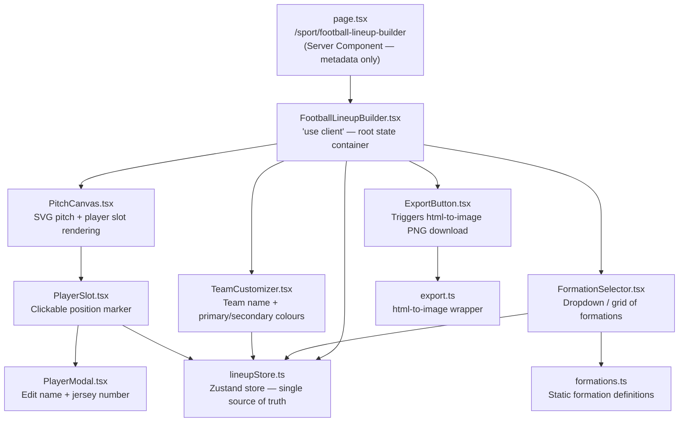
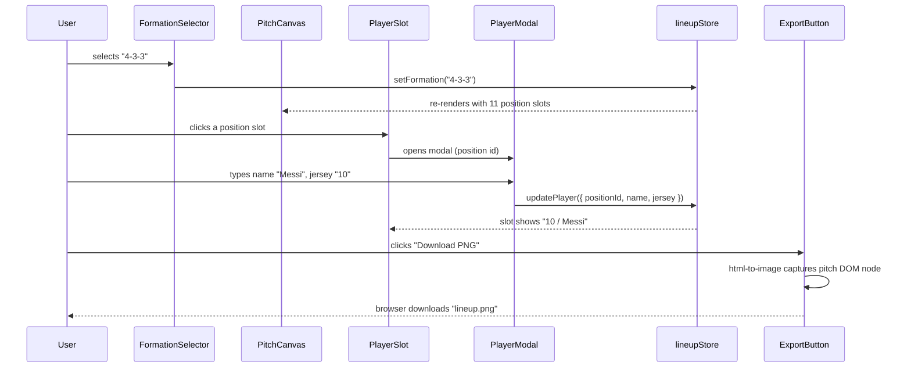
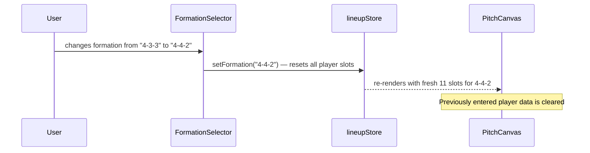
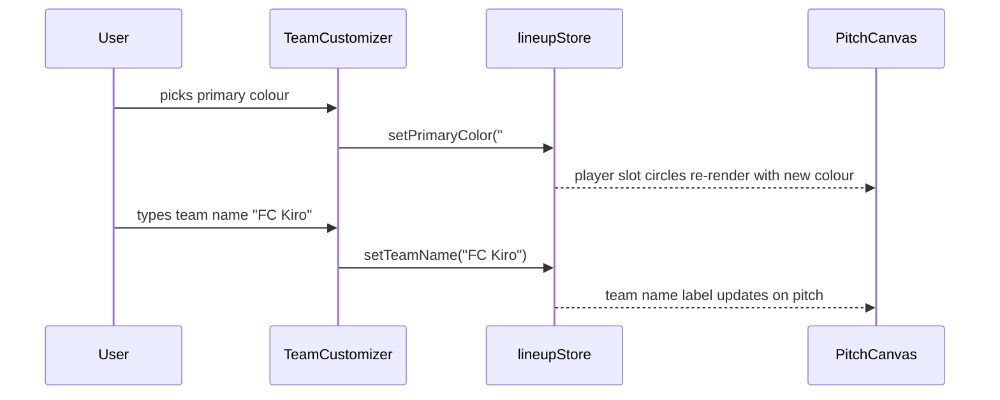

# Design Document: Football Lineup Builder

## Overview

The Football Lineup Builder is a fully client-side interactive tool that lets users compose, customise, and export football (soccer) team lineups. Users pick a formation, assign player names and jersey numbers to each position slot on a visual pitch, customise team colours, and download the result as a PNG image.

The tool lives at `/sport/football-lineup-builder` within the existing Next.js platform, following the same `page.tsx` + `components/` pattern used by other tools. There is no backend — all state is managed client-side with Zustand, and image export is handled in-browser via `html-to-image` (already a project dependency).

---

## Architecture



---

## Sequence Diagrams

### Main Flow: Build and Export a Lineup



### Flow: Change Formation (resets players)



### Flow: Customise Team Colours



---

## Components and Interfaces

### Component: `FootballLineupBuilder`

**Purpose**: Root client component. Owns layout, wires store to child components.

**Location**: `src/app/sport/football-lineup-builder/components/FootballLineupBuilder.tsx`

**Interface**:
```typescript
// No props — self-contained tool
export default function FootballLineupBuilder(): JSX.Element
```

**Responsibilities**:
- Renders the two-column layout (pitch left, controls right on desktop; stacked on mobile)
- Provides the `ref` for the pitch DOM node used by the export utility
- Renders `FormationSelector`, `TeamCustomizer`, `ExportButton`, and `PitchCanvas`

---

### Component: `PitchCanvas`

**Purpose**: Renders the football pitch as an SVG and positions `PlayerSlot` components at coordinates derived from the active formation.

**Location**: `src/app/sport/football-lineup-builder/components/PitchCanvas.tsx`

**Interface**:
```typescript
interface PitchCanvasProps {
  forwardedRef?: React.RefObject<HTMLDivElement>  // for export capture
}
export default function PitchCanvas({ forwardedRef }: PitchCanvasProps): JSX.Element
```

**Responsibilities**:
- Renders a fixed-aspect-ratio SVG pitch (portrait, 400×600 logical units)
- Maps each `PositionSlot` from the active formation to absolute `(x, y)` coordinates
- Renders team name label at the top of the pitch
- Passes slot data and click handler to each `PlayerSlot`

---

### Component: `PlayerSlot`

**Purpose**: A single interactive position marker on the pitch. Shows jersey number and player name; opens the edit modal on click.

**Location**: `src/app/sport/football-lineup-builder/components/PlayerSlot.tsx`

**Interface**:
```typescript
interface PlayerSlotProps {
  positionId: string        // e.g. "cb-1", "st-1"
  label: string             // position abbreviation e.g. "CB", "ST"
  x: number                 // percentage of pitch width (0–100)
  y: number                 // percentage of pitch height (0–100)
  player: PlayerData | null
  primaryColor: string
  secondaryColor: string
  onClick: (positionId: string) => void
}
export default function PlayerSlot(props: PlayerSlotProps): JSX.Element
```

**Responsibilities**:
- Renders a circle (primary colour fill, secondary colour border) with jersey number inside
- Renders player name below the circle
- Calls `onClick(positionId)` when clicked or tapped

---

### Component: `PlayerModal`

**Purpose**: Modal dialog for entering/editing a player's name and jersey number for a given position.

**Location**: `src/app/sport/football-lineup-builder/components/PlayerModal.tsx`

**Interface**:
```typescript
interface PlayerModalProps {
  positionId: string
  positionLabel: string     // e.g. "Centre Back"
  player: PlayerData | null
  onSave: (data: PlayerData) => void
  onClear: (positionId: string) => void
  onClose: () => void
}
export default function PlayerModal(props: PlayerModalProps): JSX.Element
```

**Responsibilities**:
- Controlled inputs for player name (max 25 chars) and jersey number (1–99)
- Save button commits changes to the store
- Clear button removes player data for this slot
- Closes on backdrop click or Escape key

---

### Component: `FormationSelector`

**Purpose**: Lets the user pick from the supported formations.

**Location**: `src/app/sport/football-lineup-builder/components/FormationSelector.tsx`

**Interface**:
```typescript
interface FormationSelectorProps {
  currentFormation: FormationId
  onChange: (id: FormationId) => void
}
export default function FormationSelector(props: FormationSelectorProps): JSX.Element
```

**Responsibilities**:
- Renders a `<select>` or button grid of all `FORMATIONS`
- Calls `onChange` with the new formation id
- Warns user that changing formation resets player data (via confirmation or inline note)

---

### Component: `TeamCustomizer`

**Purpose**: Controls for team name and kit colours.

**Location**: `src/app/sport/football-lineup-builder/components/TeamCustomizer.tsx`

**Interface**:
```typescript
interface TeamCustomizerProps {
  teamName: string
  primaryColor: string
  secondaryColor: string
  onTeamNameChange: (name: string) => void
  onPrimaryColorChange: (color: string) => void
  onSecondaryColorChange: (color: string) => void
}
export default function TeamCustomizer(props: TeamCustomizerProps): JSX.Element
```

**Responsibilities**:
- Text input for team name (max 30 chars)
- Native `<input type="color">` pickers for primary and secondary colours
- Preset colour swatches for common kit colours

---

### Component: `ExportButton`

**Purpose**: Triggers PNG export of the pitch.

**Location**: `src/app/sport/football-lineup-builder/components/ExportButton.tsx`

**Interface**:
```typescript
interface ExportButtonProps {
  pitchRef: React.RefObject<HTMLDivElement>
  teamName: string
}
export default function ExportButton(props: ExportButtonProps): JSX.Element
```

**Responsibilities**:
- Calls `exportLineupAsPng(pitchRef, teamName)` on click
- Shows loading state during export
- Handles and displays export errors

---

### Store: `lineupStore`

**Purpose**: Zustand store — single source of truth for all lineup state.

**Location**: `src/app/sport/football-lineup-builder/store/lineupStore.ts`

**Interface**:
```typescript
interface LineupStore {
  // State
  formation: FormationId
  players: Record<string, PlayerData>   // keyed by positionId
  teamName: string
  primaryColor: string
  secondaryColor: string
  activePositionId: string | null       // which slot modal is open for

  // Actions
  setFormation: (id: FormationId) => void
  updatePlayer: (positionId: string, data: PlayerData) => void
  clearPlayer: (positionId: string) => void
  setTeamName: (name: string) => void
  setPrimaryColor: (color: string) => void
  setSecondaryColor: (color: string) => void
  openModal: (positionId: string) => void
  closeModal: () => void
}
```

---

### Utility: `export.ts`

**Purpose**: Wraps `html-to-image` to capture the pitch DOM node as a PNG and trigger a browser download.

**Location**: `src/app/sport/football-lineup-builder/utils/export.ts`

**Interface**:
```typescript
export async function exportLineupAsPng(
  ref: React.RefObject<HTMLDivElement>,
  teamName: string
): Promise<void>
```

---

### Data: `formations.ts`

**Purpose**: Static definitions of all supported formations with position coordinates.

**Location**: `src/app/sport/football-lineup-builder/data/formations.ts`

**Interface**:
```typescript
export const FORMATIONS: Record<FormationId, Formation>
export const FORMATION_IDS: FormationId[]
```

---

## Data Models

### `FormationId`

```typescript
type FormationId =
  | "4-3-3"
  | "4-4-2"
  | "4-2-3-1"
  | "3-5-2"
  | "5-3-2"
  | "4-1-4-1"
  | "3-4-3"
  | "5-4-1"
  | "4-4-1-1"
  | "3-4-2-1"
  | "4-5-1"
  | "4-2-2-2"
```

### `PositionSlot`

```typescript
interface PositionSlot {
  id: string          // unique within formation e.g. "cb-1", "cm-2"
  label: string       // short label e.g. "CB", "CM", "GK"
  fullLabel: string   // full name e.g. "Centre Back", "Central Midfielder"
  x: number           // 0–100, percentage of pitch width (left = 0)
  y: number           // 0–100, percentage of pitch height (goal = 0, own goal = 100)
}
```

**Validation Rules**:
- `x` must be in range [5, 95] to keep slots visible within pitch bounds
- `y` must be in range [5, 95]
- `id` must be unique within a formation

### `Formation`

```typescript
interface Formation {
  id: FormationId
  label: string           // display name e.g. "4-3-3"
  slots: PositionSlot[]   // always exactly 11 slots (GK + outfield)
}
```

**Validation Rules**:
- `slots.length === 11`
- Exactly one slot with `label === "GK"`
- All slot `id` values are unique within the formation

### `PlayerData`

```typescript
interface PlayerData {
  name: string      // max 25 characters, may be empty string
  jersey: string    // "1"–"99", may be empty string
}
```

**Validation Rules**:
- `name.length <= 25`
- `jersey` is either empty or a string representation of an integer in [1, 99]

### `LineupState` (Zustand store shape)

```typescript
interface LineupState {
  formation: FormationId
  players: Record<string, PlayerData>
  teamName: string          // max 30 characters
  primaryColor: string      // valid CSS hex colour e.g. "#e63946"
  secondaryColor: string    // valid CSS hex colour
  activePositionId: string | null
}
```

---

## Algorithmic Pseudocode

### Formation Change Algorithm

```pascal
ALGORITHM setFormation(newFormationId)
  INPUT: newFormationId of type FormationId
  OUTPUT: updated store state

  PRECONDITION: newFormationId is a member of FORMATION_IDS
  POSTCONDITION:
    - store.formation = newFormationId
    - store.players = {} (all player data cleared)
    - store.activePositionId = null

  BEGIN
    IF newFormationId = store.formation THEN
      RETURN  // no-op
    END IF

    store.formation ← newFormationId
    store.players ← {}
    store.activePositionId ← null
  END
```

**Loop Invariants**: N/A

---

### Position Coordinate Mapping Algorithm

```pascal
ALGORITHM getSlotScreenPosition(slot, pitchWidth, pitchHeight)
  INPUT:
    slot of type PositionSlot (with x, y as 0–100 percentages)
    pitchWidth: number (rendered width in pixels)
    pitchHeight: number (rendered height in pixels)
  OUTPUT: { screenX: number, screenY: number }

  PRECONDITION:
    - slot.x ∈ [5, 95]
    - slot.y ∈ [5, 95]
    - pitchWidth > 0 AND pitchHeight > 0

  POSTCONDITION:
    - screenX ∈ [0, pitchWidth]
    - screenY ∈ [0, pitchHeight]
    - Position is within visible pitch area

  BEGIN
    screenX ← (slot.x / 100) * pitchWidth
    screenY ← (slot.y / 100) * pitchHeight
    RETURN { screenX, screenY }
  END
```

---

### Player Update Algorithm

```pascal
ALGORITHM updatePlayer(positionId, playerData)
  INPUT:
    positionId: string
    playerData: { name: string, jersey: string }
  OUTPUT: updated store state

  PRECONDITION:
    - positionId is a valid slot id in the current formation
    - playerData.name.length <= 25
    - playerData.jersey is "" OR parseInt(playerData.jersey) ∈ [1, 99]

  POSTCONDITION:
    - store.players[positionId] = playerData
    - store.activePositionId = null (modal closed)

  BEGIN
    sanitizedName ← playerData.name.trim().slice(0, 25)
    sanitizedJersey ← validateJersey(playerData.jersey)

    store.players[positionId] ← {
      name: sanitizedName,
      jersey: sanitizedJersey
    }
    store.activePositionId ← null
  END
```

---

### PNG Export Algorithm

```pascal
ALGORITHM exportLineupAsPng(pitchRef, teamName)
  INPUT:
    pitchRef: React ref pointing to the pitch DOM node
    teamName: string
  OUTPUT: triggers browser file download

  PRECONDITION:
    - pitchRef.current is a mounted HTMLDivElement
    - html-to-image library is available

  POSTCONDITION:
    - A PNG file is downloaded by the browser
    - Filename is derived from teamName (sanitised) + "-lineup.png"
    - On failure, an error is surfaced to the UI (no silent failures)

  BEGIN
    IF pitchRef.current = null THEN
      THROW Error("Pitch element not mounted")
    END IF

    dataUrl ← await htmlToImage.toPng(pitchRef.current, {
      pixelRatio: 2,          // 2× for high-DPI output
      backgroundColor: "#1a7a3c"
    })

    filename ← sanitizeFilename(teamName) + "-lineup.png"

    link ← createElement("a")
    link.href ← dataUrl
    link.download ← filename
    link.click()
  END
```

---

### Jersey Number Validation Algorithm

```pascal
FUNCTION validateJersey(input)
  INPUT: input of type string
  OUTPUT: sanitized jersey string

  PRECONDITION: input is a string (may be empty)
  POSTCONDITION:
    - Returns "" if input is empty or non-numeric
    - Returns string representation of integer clamped to [1, 99]

  BEGIN
    IF input = "" THEN
      RETURN ""
    END IF

    num ← parseInt(input, 10)

    IF isNaN(num) THEN
      RETURN ""
    END IF

    clamped ← max(1, min(99, num))
    RETURN String(clamped)
  END
```

---

## Key Functions with Formal Specifications

### `setFormation(id: FormationId): void`

**Preconditions**:
- `id` is a member of `FORMATION_IDS`

**Postconditions**:
- `store.formation === id`
- `store.players` is an empty object `{}`
- `store.activePositionId === null`
- No side effects outside the store

---

### `updatePlayer(positionId: string, data: PlayerData): void`

**Preconditions**:
- `positionId` is a valid slot `id` in `FORMATIONS[store.formation].slots`
- `data.name.length <= 25`
- `data.jersey === ""` or `Number(data.jersey)` is an integer in `[1, 99]`

**Postconditions**:
- `store.players[positionId]` equals the sanitised `data`
- `store.activePositionId === null`
- All other `store.players` entries are unchanged

---

### `clearPlayer(positionId: string): void`

**Preconditions**:
- `positionId` is a string (need not have existing player data)

**Postconditions**:
- `store.players[positionId]` is `undefined` (key removed)
- All other store state is unchanged

---

### `exportLineupAsPng(ref, teamName): Promise<void>`

**Preconditions**:
- `ref.current` is a mounted `HTMLDivElement`
- `teamName` is a string (may be empty)

**Postconditions**:
- Resolves after triggering a browser PNG download
- Rejects with a descriptive `Error` if `ref.current` is null or `html-to-image` fails
- No mutations to store state

---

### `getSlotScreenPosition(slot, pitchWidth, pitchHeight): { screenX, screenY }`

**Preconditions**:
- `slot.x` ∈ `[5, 95]`
- `slot.y` ∈ `[5, 95]`
- `pitchWidth > 0`, `pitchHeight > 0`

**Postconditions**:
- `screenX === (slot.x / 100) * pitchWidth`
- `screenY === (slot.y / 100) * pitchHeight`
- Both values are finite numbers

---

### `validateJersey(input: string): string`

**Preconditions**:
- `input` is a defined string

**Postconditions**:
- Returns `""` if `input` is empty or non-numeric
- Returns a string of an integer clamped to `[1, 99]` otherwise
- Idempotent: `validateJersey(validateJersey(x)) === validateJersey(x)`

---

## Example Usage

### Store Usage

```typescript
import { useLineupStore } from "@/app/sport/football-lineup-builder/store/lineupStore"

// Select a formation
const setFormation = useLineupStore(s => s.setFormation)
setFormation("4-3-3")

// Update a player slot
const updatePlayer = useLineupStore(s => s.updatePlayer)
updatePlayer("st-1", { name: "Messi", jersey: "10" })

// Read current state
const { formation, players, primaryColor } = useLineupStore(s => ({
  formation: s.formation,
  players: s.players,
  primaryColor: s.primaryColor,
}))
```

### Formation Data Usage

```typescript
import { FORMATIONS } from "@/app/sport/football-lineup-builder/data/formations"

const formation = FORMATIONS["4-3-3"]
// formation.slots → [
//   { id: "gk",   label: "GK", fullLabel: "Goalkeeper",        x: 50, y: 90 },
//   { id: "rb",   label: "RB", fullLabel: "Right Back",         x: 80, y: 72 },
//   { id: "cb-1", label: "CB", fullLabel: "Centre Back",        x: 60, y: 72 },
//   { id: "cb-2", label: "CB", fullLabel: "Centre Back",        x: 40, y: 72 },
//   { id: "lb",   label: "LB", fullLabel: "Left Back",          x: 20, y: 72 },
//   { id: "cm-1", label: "CM", fullLabel: "Central Midfielder", x: 70, y: 50 },
//   { id: "cm-2", label: "CM", fullLabel: "Central Midfielder", x: 50, y: 50 },
//   { id: "cm-3", label: "CM", fullLabel: "Central Midfielder", x: 30, y: 50 },
//   { id: "rw",   label: "RW", fullLabel: "Right Winger",       x: 80, y: 25 },
//   { id: "st",   label: "ST", fullLabel: "Striker",            x: 50, y: 15 },
//   { id: "lw",   label: "LW", fullLabel: "Left Winger",        x: 20, y: 25 },
// ]
```

### Export Usage

```typescript
import { exportLineupAsPng } from "@/app/sport/football-lineup-builder/utils/export"

const pitchRef = useRef<HTMLDivElement>(null)

async function handleExport() {
  try {
    await exportLineupAsPng(pitchRef, "FC Kiro")
    // browser downloads "fc-kiro-lineup.png"
  } catch (err) {
    console.error("Export failed:", err)
  }
}
```

### PitchCanvas Rendering

```typescript
// Simplified render logic inside PitchCanvas
const formation = useLineupStore(s => FORMATIONS[s.formation])
const players = useLineupStore(s => s.players)
const primaryColor = useLineupStore(s => s.primaryColor)

return (
  <div ref={forwardedRef} className="relative w-full aspect-[2/3] bg-green-700">
    <PitchSvgMarkings />
    {formation.slots.map(slot => (
      <PlayerSlot
        key={slot.id}
        positionId={slot.id}
        label={slot.label}
        x={slot.x}
        y={slot.y}
        player={players[slot.id] ?? null}
        primaryColor={primaryColor}
        onClick={openModal}
      />
    ))}
  </div>
)
```

---

## Correctness Properties

*A property is a characteristic or behavior that should hold true across all valid executions of a system — essentially, a formal statement about what the system should do. Properties serve as the bridge between human-readable specifications and machine-verifiable correctness guarantees.*

### Property 1: Formation always has exactly 11 slots

*For any* `FormationId` `f`, `FORMATIONS[f].slots.length` SHALL equal `11`.

**Validates: Requirement 1.2**

---

### Property 2: Every formation has exactly one goalkeeper

*For any* `FormationId` `f`, exactly one slot in `FORMATIONS[f].slots` SHALL have `label === "GK"`.

**Validates: Requirement 1.3**

---

### Property 3: All slot ids are unique within a formation

*For any* `FormationId` `f`, all `id` values in `FORMATIONS[f].slots` SHALL be distinct strings.

**Validates: Requirement 1.4**

---

### Property 4: Slot coordinates are within valid bounds

*For any* `PositionSlot` `s` in any formation, `s.x ∈ [5, 95]` AND `s.y ∈ [5, 95]` SHALL hold.

**Validates: Requirement 1.5**

---

### Property 5: Formation change resets all player data

*For any* store state with non-empty `players`, calling `setFormation(id)` SHALL result in `store.players` being an empty object `{}`.

**Validates: Requirement 3.1**

---

### Property 6: Player name length is bounded

*For any* call to `updatePlayer(positionId, data)`, `store.players[positionId].name.length` SHALL be `<= 25` after the call.

**Validates: Requirement 2.2**

---

### Property 7: Jersey number is always valid or empty

*For any* `PlayerData` `p` in `store.players`, `p.jersey === ""` OR `Number(p.jersey)` is an integer in `[1, 99]` SHALL hold.

**Validates: Requirements 2.3, 7.2**

---

### Property 8: validateJersey is idempotent

*For any* string `x`, `validateJersey(validateJersey(x)) === validateJersey(x)` SHALL hold.

**Validates: Requirement 7.3**

---

### Property 9: Screen position is proportional to pitch dimensions

*For any* `PositionSlot` `s` and pitch dimensions `(w, h)`, `getSlotScreenPosition(s, w, h).screenX === (s.x / 100) * w` AND `getSlotScreenPosition(s, w, h).screenY === (s.y / 100) * h` SHALL hold.

**Validates: Requirement 7.4**

---

### Property 10: Export filename is derived from team name

*For any* non-empty `teamName`, the downloaded filename SHALL contain a sanitised version of `teamName` and end with `"-lineup.png"`.

**Validates: Requirement 5.2**

---

### Property 11: Player update round-trip

*For any* valid `PlayerData` `d` and a valid `positionId` in the current formation, calling `updatePlayer(positionId, d)` SHALL result in `store.players[positionId]` containing the sanitised equivalent of `d`.

**Validates: Requirement 2.4**

---

### Property 12: Clear player does not affect other slots

*For any* store state with players assigned to multiple positions, calling `clearPlayer(positionId)` SHALL remove only the entry for `positionId` and leave all other entries unchanged.

**Validates: Requirement 2.5**

---

### Property 13: Team name length is bounded

*For any* team name input, `store.teamName.length` SHALL be `<= 30` after the update.

**Validates: Requirement 4.1**

---

## Error Handling

### Error Scenario 1: Export with unmounted pitch ref

**Condition**: `exportLineupAsPng` is called before the pitch component has mounted (e.g., rapid double-click during hydration)
**Response**: Function throws `Error("Pitch element not mounted")`; `ExportButton` catches this and shows an inline error message
**Recovery**: User waits for the page to fully render and retries

### Error Scenario 2: html-to-image failure

**Condition**: `html-to-image` fails (e.g., cross-origin image in pitch, browser security restriction)
**Response**: Promise rejects; `ExportButton` shows "Export failed — please try again"
**Recovery**: User retries; if persistent, the pitch uses only CSS colours (no external images) so this should be rare

### Error Scenario 3: Invalid jersey number input

**Condition**: User types a non-numeric or out-of-range value in the jersey field
**Response**: `validateJersey` clamps or clears the value; inline validation message shown in `PlayerModal`
**Recovery**: User corrects the value before saving

### Error Scenario 4: Formation change with existing player data

**Condition**: User changes formation after entering player names
**Response**: `FormationSelector` shows an inline warning "Changing formation will clear all player data"; change proceeds on confirmation
**Recovery**: Player data is cleared; user re-enters data for the new formation

---

## Testing Strategy

### Unit Testing Approach

Test pure functions in isolation:
- `validateJersey`: empty string, numeric strings in range, out-of-range numbers, non-numeric strings, floats
- `getSlotScreenPosition`: various slot coordinates and pitch dimensions
- `sanitizeFilename`: special characters, empty string, very long names
- Formation data integrity: all formations have 11 slots, unique ids, one GK, coordinates in bounds

### Property-Based Testing Approach

**Property Test Library**: fast-check (already a project dependency candidate; add as devDependency)

Key properties:
- `validateJersey(validateJersey(x)) === validateJersey(x)` for any string `x`
- `getSlotScreenPosition(s, w, h).screenX / w === s.x / 100` for any valid slot and positive dimensions
- For any formation, `slots.length === 11` and all `id` values are unique
- `setFormation` always results in `players === {}` regardless of prior state

### Integration Testing Approach

Test the Zustand store actions end-to-end:
- `setFormation` → verify `players` is reset and `formation` is updated
- `updatePlayer` → verify slot data is stored and modal is closed
- `clearPlayer` → verify slot data is removed without affecting other slots
- Sequence: set formation → update multiple players → change formation → verify all cleared

---

## Performance Considerations

- The pitch is rendered as a `div` with absolutely-positioned `PlayerSlot` children (CSS `position: absolute` with `left`/`top` percentages) — no canvas or WebGL needed, keeping the component tree simple and accessible
- `html-to-image` captures the DOM node at `pixelRatio: 2` for a crisp 2× export; the pitch is sized at ~400px wide in the UI, producing an ~800px wide PNG
- Zustand selectors use shallow equality to prevent unnecessary re-renders when unrelated store slices change
- Formation data (`formations.ts`) is a static module — no runtime computation for coordinate lookup
- No API calls, no network dependency — the tool works fully offline once the page is loaded

---

## Security Considerations

- All user input (player names, team name, jersey numbers) is rendered inside React's JSX, which escapes HTML by default — no XSS risk
- `html-to-image` operates entirely client-side; no user data is sent to any server
- The pitch uses only CSS colours and SVG — no external image URLs that could trigger CORS issues during export
- No authentication or sensitive data involved

---

## Dependencies

- `zustand` — already in project (`^5.0.12`); used for lineup state management
- `html-to-image` — already in project (`^1.11.13`); used for PNG export
- `lucide-react` — already in project; used for UI icons (edit, download, close)
- `tailwindcss` — already in project; used for all styling
- `fast-check` — add as devDependency for property-based tests
- No new runtime dependencies required
