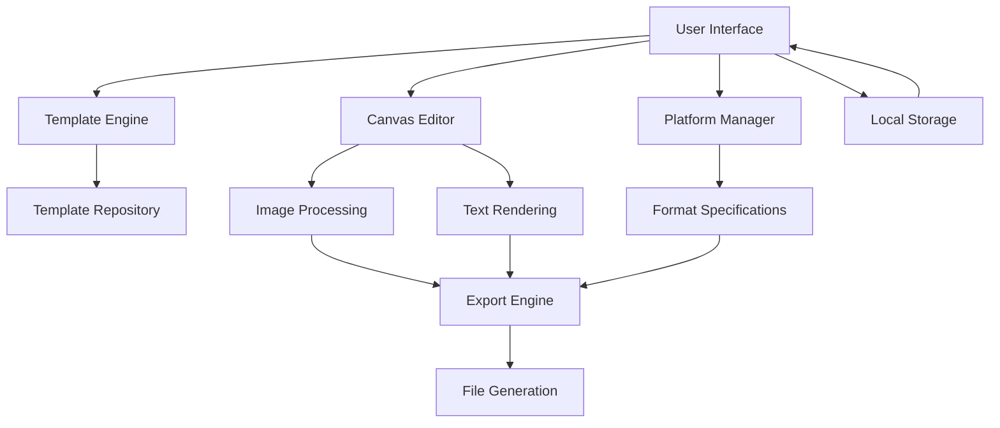

# Design Document

## Overview

The Social Carousel Builder is a web-based application that enables users to create professional carousel content for Instagram, LinkedIn, and TikTok. The system provides a template-based approach with 8 pre-designed templates, platform-specific formatting, and a user-friendly editor interface.

## Architecture

### High-Level Architecture



### Technology Stack

- **Frontend Framework**: React with TypeScript for type safety and component-based architecture
- **Canvas Rendering**: HTML5 Canvas API with Fabric.js for interactive editing capabilities
- **Image Processing**: Canvas API for resizing, cropping, and format conversion
- **State Management**: React Context API with useReducer for complex state management
- **File Handling**: File API for image uploads and Blob API for downloads
- **Styling**: Tailwind CSS for responsive design and consistent styling

## Components and Interfaces

### Core Components

#### 1. TemplateSelector Component
```typescript
interface TemplateSelector {
  templates: Template[];
  onTemplateSelect: (template: Template) => void;
  selectedTemplate?: Template;
}

interface Template {
  id: string;
  name: string;
  category: string;
  thumbnail: string;
  elements: TemplateElement[];
  defaultDimensions: Dimensions;
}
```

#### 2. PlatformSelector Component
```typescript
interface PlatformSelector {
  selectedPlatform: Platform;
  selectedFormat: PlatformFormat;
  onPlatformChange: (platform: Platform, format: PlatformFormat) => void;
}

interface Platform {
  id: 'instagram' | 'linkedin' | 'tiktok';
  name: string;
  formats: PlatformFormat[];
}

interface PlatformFormat {
  id: string;
  name: string;
  dimensions: Dimensions;
  aspectRatio: string;
}
```

#### 3. CarouselEditor Component
```typescript
interface CarouselEditor {
  slides: Slide[];
  currentSlide: number;
  template: Template;
  platform: Platform;
  format: PlatformFormat;
  onSlideUpdate: (slideIndex: number, slide: Slide) => void;
  onSlideAdd: () => void;
  onSlideDelete: (slideIndex: number) => void;
  onSlideReorder: (fromIndex: number, toIndex: number) => void;
}
```

#### 4. SlideCanvas Component
```typescript
interface SlideCanvas {
  slide: Slide;
  template: Template;
  dimensions: Dimensions;
  isEditable: boolean;
  onElementUpdate: (elementId: string, updates: Partial<TemplateElement>) => void;
}
```

#### 5. PreviewModal Component
```typescript
interface PreviewModal {
  slides: Slide[];
  isOpen: boolean;
  onClose: () => void;
  autoPlay?: boolean;
  showControls?: boolean;
}
```

#### 6. ExportManager Component
```typescript
interface ExportManager {
  slides: Slide[];
  platform: Platform;
  format: PlatformFormat;
  onExport: (exportOptions: ExportOptions) => Promise<void>;
}
```

## Data Models

### Core Data Structures

```typescript
interface Slide {
  id: string;
  elements: TemplateElement[];
  backgroundImage?: string;
  backgroundColor?: string;
}

interface TemplateElement {
  id: string;
  type: 'text' | 'image' | 'shape';
  position: Position;
  dimensions: Dimensions;
  style: ElementStyle;
  content: string | ImageContent;
  constraints: ElementConstraints;
}

interface Position {
  x: number;
  y: number;
  z: number; // layer order
}

interface Dimensions {
  width: number;
  height: number;
}

interface ElementStyle {
  fontSize?: number;
  fontFamily?: string;
  fontWeight?: string;
  color?: string;
  backgroundColor?: string;
  borderRadius?: number;
  opacity?: number;
  textAlign?: 'left' | 'center' | 'right';
}

interface ImageContent {
  src: string;
  alt: string;
  fit: 'cover' | 'contain' | 'fill';
}

interface ElementConstraints {
  minWidth?: number;
  maxWidth?: number;
  minHeight?: number;
  maxHeight?: number;
  lockAspectRatio?: boolean;
  allowResize?: boolean;
  allowMove?: boolean;
}

interface ExportOptions {
  format: 'png' | 'jpg';
  quality: number;
  includeMetadata: boolean;
  filenamePrefix: string;
}
```

### Platform Specifications

```typescript
const PLATFORM_SPECS: Record<string, Platform> = {
  instagram: {
    id: 'instagram',
    name: 'Instagram',
    formats: [
      {
        id: 'square',
        name: 'Square Post',
        dimensions: { width: 1080, height: 1080 },
        aspectRatio: '1:1'
      },
      {
        id: 'portrait',
        name: 'Portrait (3:4)',
        dimensions: { width: 1080, height: 1350 },
        aspectRatio: '3:4'
      },
      {
        id: 'stories',
        name: 'Stories',
        dimensions: { width: 1080, height: 1920 },
        aspectRatio: '9:16'
      }
    ]
  },
  linkedin: {
    id: 'linkedin',
    name: 'LinkedIn',
    formats: [
      {
        id: 'standard',
        name: 'Standard Post',
        dimensions: { width: 1200, height: 1200 },
        aspectRatio: '1:1'
      }
    ]
  },
  tiktok: {
    id: 'tiktok',
    name: 'TikTok',
    formats: [
      {
        id: 'vertical',
        name: 'Vertical Video',
        dimensions: { width: 1080, height: 1920 },
        aspectRatio: '9:16'
      }
    ]
  }
};
```

## Error Handling

### Error Types and Handling Strategies

1. **Image Upload Errors**
   - File size validation (max 10MB)
   - File type validation (jpg, png, gif)
   - Graceful fallback to placeholder images
   - User-friendly error messages

2. **Canvas Rendering Errors**
   - Fallback to basic HTML rendering
   - Error boundary components to prevent app crashes
   - Automatic retry mechanisms for transient failures

3. **Export Errors**
   - Validation of slide content before export
   - Progress indicators for long-running exports
   - Retry mechanisms with exponential backoff
   - Clear error messages with suggested solutions

4. **Storage Errors**
   - Local storage quota exceeded handling
   - Automatic cleanup of old saved projects
   - Data corruption detection and recovery

### Error Recovery Mechanisms

```typescript
interface ErrorBoundary {
  fallbackComponent: React.ComponentType;
  onError: (error: Error, errorInfo: ErrorInfo) => void;
  resetOnPropsChange?: boolean;
}

interface RetryConfig {
  maxAttempts: number;
  baseDelay: number;
  maxDelay: number;
  backoffFactor: number;
}
```

## Testing Strategy

### Unit Testing
- Component testing with React Testing Library
- Utility function testing with Jest
- Canvas operations testing with mock Canvas API
- State management testing with custom hooks

### Integration Testing
- Template loading and rendering
- Platform format switching
- Slide management operations
- Export functionality end-to-end

### Visual Regression Testing
- Template rendering consistency
- Platform format accuracy
- Export output validation
- Cross-browser compatibility

### Performance Testing
- Canvas rendering performance with multiple slides
- Image processing performance with large files
- Memory usage monitoring during extended sessions
- Export speed optimization

### Test Coverage Goals
- Minimum 80% code coverage
- 100% coverage for critical paths (export, save/load)
- Visual testing for all 8 templates across all platform formats

## Performance Considerations

### Optimization Strategies

1. **Canvas Performance**
   - Lazy loading of non-visible slides
   - Canvas virtualization for large carousels
   - Debounced rendering updates
   - Efficient layer management

2. **Image Processing**
   - Client-side image compression
   - Progressive image loading
   - Thumbnail generation for previews
   - WebP format support where available

3. **Memory Management**
   - Automatic cleanup of unused canvas contexts
   - Image cache management with LRU eviction
   - Garbage collection optimization for large objects

4. **User Experience**
   - Skeleton loading states
   - Progressive enhancement
   - Offline capability with service workers
   - Responsive design for mobile devices

## Security Considerations

### Data Protection
- Client-side only processing (no server uploads)
- Secure handling of user-uploaded images
- XSS prevention in user-generated content
- Content Security Policy implementation

### File Handling Security
- File type validation and sanitization
- Size limits to prevent DoS attacks
- Safe filename generation for exports
- Malicious file detection