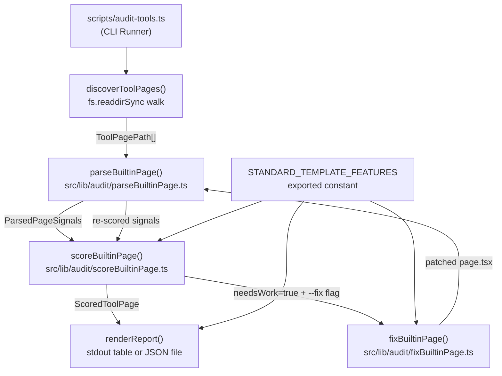

# Design Document: Tool Quality Audit System

## Overview

The Tool Quality Audit System is a developer-facing CLI that statically analyses every built-in tool page (`src/app/{category}/{tool-slug}/page.tsx`) and scores it against a defined quality rubric. It mirrors the existing `scoreToolDraft` / `scorePageDraft` pattern in `src/lib/generation/score.ts` but targets the static Next.js route files rather than database records.

The system has three layers:

1. **Parser** (`src/lib/audit/parseBuiltinPage.ts`) — reads a `page.tsx` file as text and extracts structured signals via regex/string analysis.
2. **Scorer** (`src/lib/audit/scoreBuiltinPage.ts`) — consumes a `ParsedPageSignals` object and returns a `ScoredToolPage` with sub-scores, warnings, and a `needsWork` flag.
3. **CLI Runner** (`scripts/audit-tools.ts`) — discovers tool pages, orchestrates parse → score, and renders the ranked report.

The reference implementation is `src/app/finance/compound-interest-calculator/page.tsx`, which defines the Standard Template every tool page should conform to.

---

## Architecture



Data flows strictly left-to-right in audit mode. In fix mode, the Fixer patches the file on disk and the CLI re-runs parse → score to verify the fix, producing a before/after score pair.

---

## Components and Interfaces

### `scripts/audit-tools.ts` — CLI Runner

Entry point. Uses `parseArgs` from `scripts/_shared.ts` (same pattern as `validate-all.ts`).

**Supported flags:**

| Flag | Type | Default | Description |
|---|---|---|---|
| `--json` | boolean | false | Write `audit-report.json` instead of printing table |
| `--fix` | boolean | false | Automatically fix all resolvable warnings for each tool that needs work |
| `--category=<name>` | string | all | Restrict audit to one category |
| `--threshold=<n>` | number | 70 | Override the `needsWork` threshold |
| `--tool=<path>` | string | — | Audit (or fix) a single tool (e.g. `finance/compound-interest-calculator`) |
| `--checklist` | boolean | false | Generate `TOOL_TEMPLATE_CHECKLIST.md` and exit |

**Responsibilities:**
- Call `discoverToolPages(category?)` to get the list of paths
- For each path: call `parseBuiltinPage(path)`, then `scoreBuiltinPage(signals, { threshold })`
- Catch parse/score errors per-tool, log with `fail()`, continue
- Sort results ascending by `overallScore`
- Render table to stdout or write JSON file
- Print summary line: total audited, flagged count, average score

### `src/lib/audit/parseBuiltinPage.ts` — Parser

Pure function. Reads a file path synchronously, returns `ParsedPageSignals`. Never throws — on any error the signal is recorded as absent/zero.

```typescript
export function parseBuiltinPage(filePath: string): ParsedPageSignals
```

Internally uses `fs.readFileSync(filePath, 'utf8')` then applies regex/string checks against the raw text.

### `src/lib/audit/scoreBuiltinPage.ts` — Scorer

Pure function. Takes `ParsedPageSignals` and options, returns `ScoredToolPage`.

```typescript
export function scoreBuiltinPage(
  signals: ParsedPageSignals,
  options?: { threshold?: number }
): ScoredToolPage
```

Also exports:

```typescript
export const STANDARD_TEMPLATE_FEATURES: StandardTemplateFeature[]
```

### Discovery helper (inline in CLI or extracted to `src/lib/audit/discoverToolPages.ts`)

```typescript
export function discoverToolPages(category?: string): ToolPagePath[]
```

Walks `src/app/{category}/` directories. Includes a path only when both `page.tsx` and `components/` exist in the same directory. Excludes category index pages and `[dynamic]` segments.

### `src/lib/audit/fixBuiltinPage.ts` — Fixer

Reads a `page.tsx` file, applies string-level patches for each fixable warning, writes the result back to disk, and returns a `FixResult`.

```typescript
export function fixBuiltinPage(
  filePath: string,
  scored: ScoredToolPage
): FixResult
```

```typescript
export interface FixResult {
  filePath: string;
  appliedFixes: string[];   // warning ids that were patched
  skippedWarnings: string[]; // warnings that require human intervention
}
```

**Fixable warnings and their patch strategies:**

| Warning | Patch strategy |
|---|---|
| `"Missing revalidate export"` | Insert `export const revalidate = 43200;` after the last import line |
| `"Missing canonical URL"` | Add `alternates: { canonical: PAGE_URL }` inside the existing `metadata` object (requires `PAGE_URL` constant to already exist) |
| `"Missing OpenGraph metadata"` | Add minimal `openGraph: { type: "website", url: PAGE_URL, title: ..., description: ... }` block inside `metadata` |
| `"Missing Twitter card metadata"` | Add minimal `twitter: { card: "summary_large_image", title: ..., description: ... }` block inside `metadata` |
| `"Missing WebApplication structured data"` | Add `buildWebApplicationJsonLd()` function and `<JsonLd data={serializeJsonLd(...)} />` render call |
| `"Missing BreadcrumbList structured data"` | Add `buildBreadcrumbJsonLd` call and `<JsonLd>` render |
| `"Missing FAQPage structured data"` | Add `buildFaqJsonLd(faq)` call and `<JsonLd>` render (only when `const faq` array exists) |
| `"Missing PrivacyNote"` | Add `PrivacyNote` to the existing `ToolPageScaffold` import and insert `<PrivacyNote />` in the header section |
| `"Missing RelatedToolsSection"` | Add `RelatedToolsSection` to the existing `ToolPageScaffold` import and append `<RelatedToolsSection ... />` before the closing `</div>` |
| `"Missing category chip label"` | Insert the `primary-chip` `<p>` element above the `<h1>` |
| `"Missing breadcrumb navigation"` | Insert a breadcrumb `<nav>` element above the category chip |

**Non-fixable warnings (always skipped):**
- `"Weak or missing metadata title"` — requires human-written copy
- `"Weak or missing metadata description"` — requires human-written copy
- `"Insufficient keywords"` — requires keyword research
- `"FAQ has fewer than 4 items"` — requires content generation
- `"Missing explanatory content section"` — requires content generation
- `"Missing H1 heading"` — structural issue requiring manual review
- `"Missing intro paragraph"` — requires human-written copy

The Fixer uses conservative string manipulation: it locates known anchor patterns (e.g. the `metadata` export object, the last `<JsonLd` line, the `<h1>` element) and inserts/appends content relative to those anchors. It never deletes existing content.

---

## Data Models

### `ParsedPageSignals`

Extracted by the Parser from raw `page.tsx` text.

```typescript
export interface ParsedPageSignals {
  // SEO signals
  metaTitleLength: number;          // 0 if absent
  metaDescriptionLength: number;    // 0 if absent
  metaKeywordsCount: number;        // 0 if absent
  hasCanonical: boolean;
  hasOpenGraph: boolean;
  hasTwitterCard: boolean;
  hasWebApplicationJsonLd: boolean;
  hasBreadcrumbJsonLd: boolean;
  hasFaqPageJsonLd: boolean;
  hasExplanatorySection: boolean;

  // UX signals
  hasH1: boolean;
  hasBreadcrumbNav: boolean;
  hasPrivacyNote: boolean;
  hasRelatedToolsSection: boolean;
  hasCategoryChip: boolean;
  hasIntroP: boolean;
  hasRevalidateExport: boolean;

  // Feature signals
  faqItemCount: number;
  explanatorySectionH2Count: number;
  introPLength: number;             // 0 if absent
}
```

### `ScoredToolPage`

Returned by the Scorer.

```typescript
export interface ScoredToolPage {
  toolSlug: string;
  category: string;
  pagePath: string;
  seoScore: number;       // 0–100
  uxScore: number;        // 0–100
  featureScore: number;   // 0–100
  overallScore: number;   // 0–100, weighted composite
  needsWork: boolean;
  warnings: string[];
  missingFeatures: string[];  // names of absent Standard Template features
}

export interface FixResult {
  filePath: string;
  appliedFixes: string[];    // warning ids that were patched
  skippedWarnings: string[]; // warnings that require human intervention
  scoreBefore: number;
  scoreAfter: number;
  fixStatus: "fixed" | "partial" | "skipped";
}
```

### `StandardTemplateFeature`

```typescript
export interface StandardTemplateFeature {
  id: string;             // machine-readable key
  label: string;          // human-readable name
  description: string;    // what it is and why it matters
  weight: number;         // share of Feature_Score (weights sum to 100)
  example: string;        // code snippet or description from compound-interest-calculator
  signalKey: keyof ParsedPageSignals;  // which signal to check
}
```

### `ToolPagePath`

```typescript
export interface ToolPagePath {
  category: string;
  toolSlug: string;
  pagePath: string;   // absolute path to page.tsx
}
```

---

## Scoring Details

### SEO Score (weight 40%)

Starting base: 100. Deductions applied for absent/weak signals.

| Check | Warning | Deduction |
|---|---|---|
| `metaTitleLength < 30` | `"Weak or missing metadata title"` | −15 |
| `metaDescriptionLength < 80` | `"Weak or missing metadata description"` | −15 |
| `metaKeywordsCount < 5` | `"Insufficient keywords"` | −5 |
| `!hasCanonical` | `"Missing canonical URL"` | −10 |
| `!hasOpenGraph` | `"Missing OpenGraph metadata"` | −10 |
| `!hasTwitterCard` | `"Missing Twitter card metadata"` | −8 |
| `!hasWebApplicationJsonLd` | `"Missing WebApplication structured data"` | −12 |
| `!hasBreadcrumbJsonLd` | `"Missing BreadcrumbList structured data"` | −8 |
| `!hasFaqPageJsonLd` | `"Missing FAQPage structured data"` | −8 |
| `faqItemCount < 4` | `"FAQ has fewer than 4 items"` | −5 |
| `!hasExplanatorySection` | `"Missing explanatory content section"` | −10 |

Score clamped to [0, 100].

### UX Score (weight 35%)

Starting base: 100. Deductions applied for absent signals.

| Check | Warning | Deduction |
|---|---|---|
| `!hasBreadcrumbNav` | `"Missing breadcrumb navigation"` | −20 |
| `!hasH1` | `"Missing H1 heading"` | −20 |
| `!hasIntroP` | `"Missing intro paragraph"` | −15 |
| `!hasPrivacyNote` | `"Missing PrivacyNote"` | −15 |
| `!hasRelatedToolsSection` | `"Missing RelatedToolsSection"` | −15 |
| `!hasCategoryChip` | `"Missing category chip label"` | −8 |
| `!hasRevalidateExport` | `"Missing revalidate export"` | −7 |

Score clamped to [0, 100].

### Feature Score (weight 25%)

Each Standard Template feature is worth a proportional share. A feature is present or absent; partial credit is not awarded.

| Feature | `signalKey` | Weight |
|---|---|---|
| Explanatory section with ≥2 `<h2>` | `explanatorySectionH2Count >= 2` | 15 |
| FAQ section with ≥4 items | `faqItemCount >= 4` | 15 |
| `RelatedToolsSection` component | `hasRelatedToolsSection` | 15 |
| `PrivacyNote` component | `hasPrivacyNote` | 15 |
| `WebApplication` JSON-LD with `featureList` | `hasWebApplicationJsonLd` | 15 |
| Breadcrumb nav + JSON-LD | `hasBreadcrumbNav && hasBreadcrumbJsonLd` | 15 |
| Category chip label | `hasCategoryChip` | 5 |
| Intro paragraph ≥80 chars | `introPLength >= 80` | 5 |

Feature_Score = sum of weights for present features. Clamped to [0, 100].

### Overall Score

```
overallScore = clamp(seoScore × 0.40 + uxScore × 0.35 + featureScore × 0.25, 0, 100)
```

`needsWork = overallScore < threshold` (default threshold = 70).

---

## Parser Implementation Notes

All signal extraction is done via regex or `String.includes()` on the raw file text. No AST parsing is used — this keeps the parser fast and dependency-free.

Key patterns (illustrative, not exhaustive):

```typescript
// metadata.title
const titleMatch = source.match(/title\s*:\s*["'`]([^"'`]+)["'`]/);
signals.metaTitleLength = titleMatch ? titleMatch[1].length : 0;

// metadata.description
const descMatch = source.match(/description\s*:\s*["'`]([^"'`]+)["'`]/);
signals.metaDescriptionLength = descMatch ? descMatch[1].length : 0;

// metadata.keywords array — count items
const kwMatch = source.match(/keywords\s*:\s*\[([^\]]+)\]/s);
signals.metaKeywordsCount = kwMatch
  ? (kwMatch[1].match(/["'`][^"'`]+["'`]/g) ?? []).length
  : 0;

// JSON-LD blocks
signals.hasWebApplicationJsonLd = source.includes('"WebApplication"');
signals.hasBreadcrumbJsonLd = source.includes('"BreadcrumbList"');
signals.hasFaqPageJsonLd = source.includes('"FAQPage"');

// Component presence
signals.hasPrivacyNote = source.includes('<PrivacyNote');
signals.hasRelatedToolsSection = source.includes('<RelatedToolsSection');
signals.hasCategoryChip = source.includes('primary-chip');
signals.hasRevalidateExport = source.includes('export const revalidate');

// FAQ items — count objects in the faq array
const faqArrayMatch = source.match(/const faq\s*=\s*\[([^\]]+)\]/s);
signals.faqItemCount = faqArrayMatch
  ? (faqArrayMatch[1].match(/\{/g) ?? []).length
  : 0;
```

When any regex fails or the file cannot be read, the relevant signal defaults to `false` / `0` — the parser never propagates exceptions.

---

## Report Output

### Stdout table (default)

```
Tool Quality Audit — 47 tools audited, 12 need work, avg score 74.3

Rank  Category    Tool Slug                        Overall  SEO   UX    Feat  ⚠
────  ──────────  ───────────────────────────────  ───────  ────  ────  ────  ──
   1  health      bmi-calculator                      42    38    51    40    ✗
   2  text        word-counter                         55    60    48    55    ✗
  ...
  47  finance     compound-interest-calculator         98    97    99    98    ✓
```

### JSON output (`--json`)

Writes `audit-report.json` to the project root:

```json
[
  {
    "toolSlug": "bmi-calculator",
    "category": "health",
    "pagePath": "src/app/health/bmi-calculator/page.tsx",
    "seoScore": 38,
    "uxScore": 51,
    "featureScore": 40,
    "overallScore": 42,
    "needsWork": true,
    "warnings": ["Missing canonical URL", "Missing FAQPage structured data"],
    "missingFeatures": ["FAQ section with ≥4 items", "WebApplication JSON-LD with featureList"]
  }
]
```

### Single-tool output (`--tool`)

```
Auditing: src/app/health/bmi-calculator/page.tsx
Overall: 42  SEO: 38  UX: 51  Features: 40  [NEEDS WORK]

Warnings and suggested fixes:
  ✗ Missing canonical URL
    → Add: alternates: { canonical: absoluteUrl(PAGE_PATH) }
      (see compound-interest-calculator/page.tsx line ~30)
  ✗ Missing FAQPage structured data
    → Add buildFaqJsonLd(faq) and render <JsonLd data={...} />
      (see compound-interest-calculator/page.tsx)
```

---

## Correctness Properties

*A property is a characteristic or behavior that should hold true across all valid executions of a system — essentially, a formal statement about what the system should do. Properties serve as the bridge between human-readable specifications and machine-verifiable correctness guarantees.*

### Property 1: Discovery correctness

*For any* simulated filesystem structure under `src/app/{category}/`, the set of discovered tool paths must contain exactly those directories that have both a `page.tsx` file and a `components/` subdirectory, excluding category-level index pages and directories whose names start with `[`.

**Validates: Requirements 1.1, 1.2, 1.3, 1.4, 1.5**

### Property 2: Parser robustness

*For any* string passed as the content of a `page.tsx` file (including empty strings, binary-like content, and malformed TypeScript), `parseBuiltinPage` must return a `ParsedPageSignals` object without throwing an exception.

**Validates: Requirements 2.1, 2.2**

### Property 3: Parser accuracy

*For any* `page.tsx` content string constructed with a known set of signals present or absent, the `ParsedPageSignals` returned by `parseBuiltinPage` must match the expected signal values.

**Validates: Requirements 2.1**

### Property 4: Sub-score range invariant

*For any* `ParsedPageSignals` object, all three sub-scores (`seoScore`, `uxScore`, `featureScore`) returned by `scoreBuiltinPage` must be in the range [0, 100].

**Validates: Requirements 3.1, 4.1, 5.1**

### Property 5: Warnings match signals

*For any* `ParsedPageSignals` object, the `warnings` array returned by `scoreBuiltinPage` must contain exactly the warnings whose trigger conditions are satisfied by the signal values — no more, no fewer.

**Validates: Requirements 3.2–3.12, 4.2–4.8, 5.3**

### Property 6: Overall score formula

*For any* `ScoredToolPage`, the `overallScore` must equal `clamp(seoScore × 0.40 + uxScore × 0.35 + featureScore × 0.25, 0, 100)`, where clamp constrains the value to [0, 100].

**Validates: Requirements 6.1, 6.2**

### Property 7: needsWork flag

*For any* `overallScore` and `threshold`, the `needsWork` field must be `true` if and only if `overallScore < threshold`.

**Validates: Requirements 6.3**

### Property 8: Sort order

*For any* list of `ScoredToolPage` objects, after sorting the list must be non-decreasing by `overallScore` (lowest-scoring tools first).

**Validates: Requirements 7.1**

### Property 9: Summary statistics correctness

*For any* list of `ScoredToolPage` objects, the reported total count must equal `list.length`, the `needsWork` count must equal the number of items where `needsWork === true`, and the average score must equal the arithmetic mean of all `overallScore` values.

**Validates: Requirements 7.3**

### Property 10: Category filter

*For any* category name and list of `ScoredToolPage` objects, filtering by that category must return only items whose `category` field equals the given name.

**Validates: Requirements 7.5**

### Property 11: Missing features consistency

*For any* `ParsedPageSignals`, every feature name in the `missingFeatures` array of the scored result must correspond to an entry in `STANDARD_TEMPLATE_FEATURES`.

**Validates: Requirements 5.2, 5.4, 8.3**

---

## Error Handling

| Scenario | Behaviour |
|---|---|
| `page.tsx` file unreadable (permissions, missing) | Parser returns zeroed `ParsedPageSignals`; CLI logs error with `fail()` and continues |
| Regex match throws (malformed source) | Caught inside parser; signal defaults to absent/0 |
| `--tool` path does not exist | CLI prints descriptive error and calls `process.exit(1)` |
| `--category` value not in known list | CLI prints warning listing valid categories and exits |
| `--threshold` value non-numeric | `parseNumberArg` from `_shared.ts` falls back to default 70 |
| JSON write fails (`--json`) | CLI logs error with `fail()` and exits with non-zero code |
| Fixer cannot locate anchor pattern in file | Skips that specific fix, records warning as `skipped`, continues with remaining fixes |
| Fixer write fails (permissions) | Logs error with `fail()`, marks tool as `skipped`, continues to next tool |
| Re-score after fix shows no improvement | Records `fixStatus: "partial"` or `"skipped"` as appropriate; does not retry |

---

## Testing Strategy

### Unit tests (example-based)

- `STANDARD_TEMPLATE_FEATURES` exports all 8 required features and weights sum to 100
- `ScoredToolPage` returned by scorer contains all required fields
- Single-tool output includes a suggested fix for each warning
- `--tool` with non-existent path exits with non-zero code
- `--checklist` generates a file containing all 8 feature entries

### Property-based tests

Property-based testing library: **fast-check** (already available in the JS ecosystem; add as a dev dependency).

Each property test runs a minimum of 100 iterations.

Tag format: `// Feature: tool-quality-audit-system, Property {N}: {property_text}`

| Property | Test description |
|---|---|
| P1: Discovery correctness | Generate random sets of directory entries; verify discovered set matches expected |
| P2: Parser robustness | `fc.string()` as file content; verify no throw, valid object returned |
| P3: Parser accuracy | Generate page.tsx strings with known signals; verify parsed signals match |
| P4: Sub-score range | `fc.record({ ... })` of arbitrary signal booleans/numbers; verify all scores in [0,100] |
| P5: Warnings match signals | Same generator; compute expected warnings independently; verify exact match |
| P6: Overall score formula | `fc.tuple(fc.integer({min:0,max:100}), ...)` for three sub-scores; verify formula |
| P7: needsWork flag | `fc.tuple(fc.integer({min:0,max:100}), fc.integer({min:0,max:100}))` for score+threshold |
| P8: Sort order | `fc.array(fc.record({overallScore: fc.integer({min:0,max:100}), ...}))` |
| P9: Summary statistics | Same array generator; verify count/needsWork count/average |
| P10: Category filter | `fc.array(...)` of ScoredToolPage with random categories; verify filter |
| P11: Missing features consistency | Arbitrary signals; verify missingFeatures ⊆ STANDARD_TEMPLATE_FEATURES ids |

Integration tests (example-based, run against real filesystem):
- Full audit run against `src/app/finance/compound-interest-calculator` scores ≥ 90
- `--json` flag writes a valid JSON array to `audit-report.json`
- `--checklist` flag writes `TOOL_TEMPLATE_CHECKLIST.md` with all required sections
